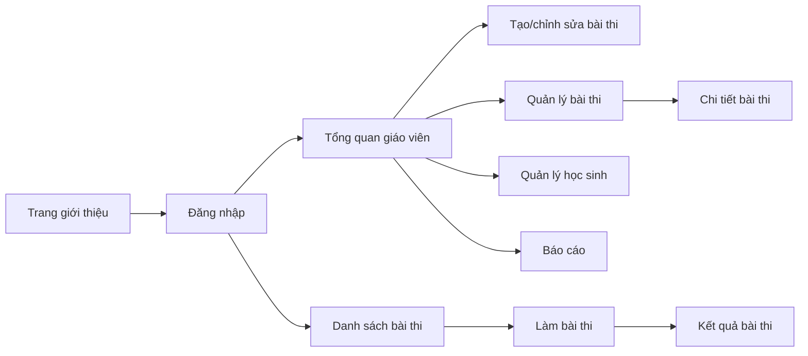

# Danh mục màn hình

Mỗi màn hình có một file đặc tả riêng. File đặc tả bao gồm mô tả giao diện, wireframe, trạng thái, API và các use case liên quan.

Tất cả màn hình trong danh mục đã được đối chiếu với production ngày 28/07/2026.
Riêng thao tác gửi request tới AI chưa thể kiểm thử do tài khoản không còn quota.

| Màn hình | Route | Đặc tả |
| --- | --- | --- |
| Trang giới thiệu | `/`, `/home` | [Xem đặc tả](screens/landing-page.md) |
| Đăng nhập | `/login` | [Xem đặc tả](screens/login.md) |
| Tổng quan giáo viên | `/teacher`, `/teacher-dashboard` | [Xem đặc tả](screens/teacher-dashboard.md) |
| Tạo/chỉnh sửa bài thi | `/create-exercise`, `/edit-exercise/:id` | [Xem đặc tả](screens/create-edit-exercise.md) |
| Quản lý bài thi | `/exercise-list` | [Xem đặc tả](screens/exercise-list.md) |
| Chi tiết bài thi | `/view-exercise/:id` | [Xem đặc tả](screens/view-exercise.md) |
| Danh sách bài thi của học sinh | `/student`, `/student/dashboard`, `/student-dashboard` | [Xem đặc tả](screens/student-dashboard.md) |
| Làm bài thi | `/student/exam/:id` | [Xem đặc tả](screens/take-exam.md) |
| Kết quả bài thi | `/student/exam-result/:id` | [Xem đặc tả](screens/exam-result.md) |
| Quản lý học sinh | `/teacher/students` | [Xem đặc tả](screens/student-management.md) |
| Báo cáo giáo viên | `/reports` | [Xem đặc tả](screens/teacher-reports.md) |
| Thử nghiệm parser | `/parse-demo` | [Xem đặc tả](screens/parse-demo.md) |
| Kiểm thử API/đăng nhập | `/api-test`, `/login-test` | [Xem đặc tả](screens/dev-test-screens.md) |
| Bố cục và tiện ích dùng chung | Không có route độc lập | [Xem đặc tả](screens/shared-layout-widgets.md) |

## Sơ đồ điều hướng

