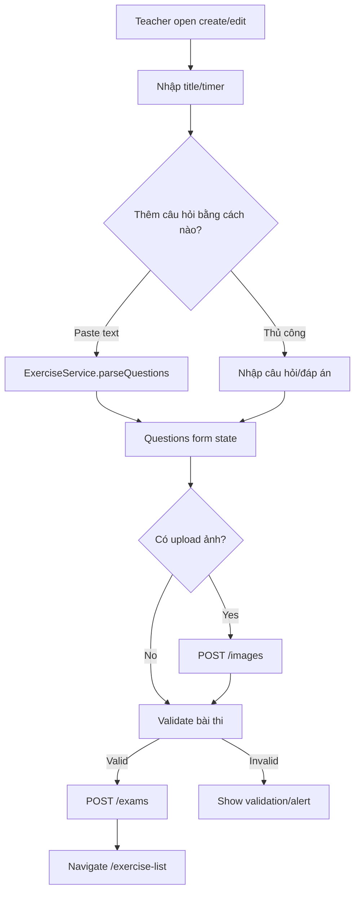

# Màn hình tạo/chỉnh sửa bài thi

## Thông tin chung

| Mục | Nội dung |
| --- | --- |
| Route | `/create-exercise`, `/edit-exercise/:id` |
| Component | `CreateExerciseComponent` |
| Tác nhân | Giáo viên |
| Mục tiêu | Tạo bài thi trắc nghiệm và gửi lên backend |

## Dữ liệu đầu vào chính

| Input | Ghi chú |
| --- | --- |
| `title` | Tên bài thi, map sang `exam_name` khi submit |
| `timer` | Chuỗi thời gian: `30m`, `1h`, `1h30m`, `1h 30m`, `2h15m30s` |
| `questions` | Danh sách câu hỏi trong form |
| `image` | Ảnh câu hỏi, upload qua `/images` |

## Cách thêm câu hỏi

- Paste text và parse.
- Thêm thủ công từng câu.
- Mỗi câu có nhiều đáp án.
- Hỗ trợ câu một đáp án và nhiều đáp án.

Format parse:

```text
Câu hỏi?
a) Đáp án A
b) Đáp án B (đúng)
c) Đáp án C
d) Đáp án D
```

## Hành động

- Parse câu hỏi.
- Thêm/xóa câu hỏi.
- Thêm/xóa đáp án.
- Chọn đáp án đúng.
- Upload/xóa ảnh câu hỏi.
- Xem preview học sinh.
- Lưu bài thi.

## Dữ liệu và API

- Upload ảnh: `ExerciseService.uploadImage()` -> `POST /images`.
- Tạo bài: `ApiService.createTest()` -> `POST /exams`.

## Request tạo bài

```json
{
  "exam_name": "Tên bài thi",
  "timer": "1h30m",
  "questions": [
    {
      "content": "Câu hỏi?",
      "answers": ["A", "B", "C", "D"],
      "correct_answers": [1],
      "image": "filename.png"
    }
  ]
}
```

## Đối chiếu production

- Đã kiểm tra luồng tạo và parse cục bộ ngày 28/07/2026, không bấm lưu.
- Ban đầu màn hình hiển thị thông tin cơ bản, hướng dẫn định dạng, textarea,
  các nút `Parse câu hỏi`, `Xóa`, `Thêm câu hỏi thủ công` và hai tab preview.
- Sau khi parse thành công, mỗi câu có bộ chọn loại câu hỏi, nội dung, ảnh, danh
  sách đáp án, ô đánh dấu đáp án đúng và nút thêm/xóa đáp án.
- Tab góc nhìn học sinh được bật sau khi có câu hỏi hợp lệ.
- Route `/edit-exercise/:id` đã có nhưng danh sách production không có nút sửa.
  Luồng edit phụ thuộc dữ liệu local nên mở hoặc tải mới trực tiếp có thể thiếu dữ liệu.

## Sơ đồ luồng




## Mô tả giao diện

Đây là form dài theo chiều dọc. Đầu trang là thông tin cơ bản; tiếp theo là vùng nhập văn bản để parse, danh sách câu hỏi có thể chỉnh sửa, upload ảnh và đánh dấu đáp án đúng; cuối trang là hai tab preview và cụm nút Hủy/Lưu.

## Wireframe giao diện

Wireframe low-fidelity dưới đây mô tả vị trí tương đối của các vùng UI trên desktop. Trên màn hình nhỏ, các cột và card được xếp dọc theo CSS responsive hiện tại.

```text
+--------------------------------------------------------------------------------+
| Header giáo viên                                                               |
+--------------------------------------------------------------------------------+
| TẠO / CHỈNH SỬA BÀI TẬP                                                       |
+--------------------------------------------------------------------------------+
| THÔNG TIN CƠ BẢN                                                              |
| Tên bài tập [____________________________________________]                     |
| Thời gian    [________________]  Ví dụ: 30m, 1h30m                             |
+--------------------------------------------------------------------------------+
| NHẬP CÂU HỎI THEO ĐỊNH DẠNG                                                   |
| +----------------------------------------------------------------------------+ |
| | Textarea nội dung câu hỏi                                                  | |
| |                                                                            | |
| +----------------------------------------------------------------------------+ |
| [Parse câu hỏi] [Xóa]                 Kết quả parse / lỗi                      |
+--------------------------------------------------------------------------------+
| [Thêm câu hỏi thủ công]                                                       |
| +----------------------------------------------------------------------------+ |
| | Câu 1                 [Loại câu hỏi v] [Xóa]                               | |
| | Nội dung [______________________________________________________________]  | |
| | Ảnh: [Chọn ảnh] [Xóa ảnh]         [Ảnh xem trước]                         | |
| | A. [Đúng] [Nội dung đáp án________________________] [Xóa]                 | |
| | B. [    ] [Nội dung đáp án________________________] [Xóa]                 | |
| | [Thêm đáp án]                                                             | |
| +----------------------------------------------------------------------------+ |
+--------------------------------------------------------------------------------+
| PREVIEW: [Thông tin bài] [Góc nhìn học sinh]                                  |
| +----------------------------------------------------------------------------+ |
| | Nội dung preview                                                           | |
| +----------------------------------------------------------------------------+ |
|                                                     [Hủy] [Lưu bài tập]       |
+--------------------------------------------------------------------------------+
```

## Use case liên quan

- [UC-TEACHER-002: Tạo bài thi](../usecases/uc-teacher-002-create-exam.md)
- [UC-TEACHER-003: Phân tích câu hỏi từ văn bản](../usecases/uc-teacher-003-parse-questions.md)
- [UC-TEACHER-004: Tải ảnh câu hỏi](../usecases/uc-teacher-004-upload-question-image.md)
