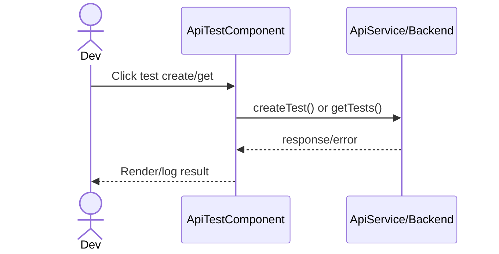
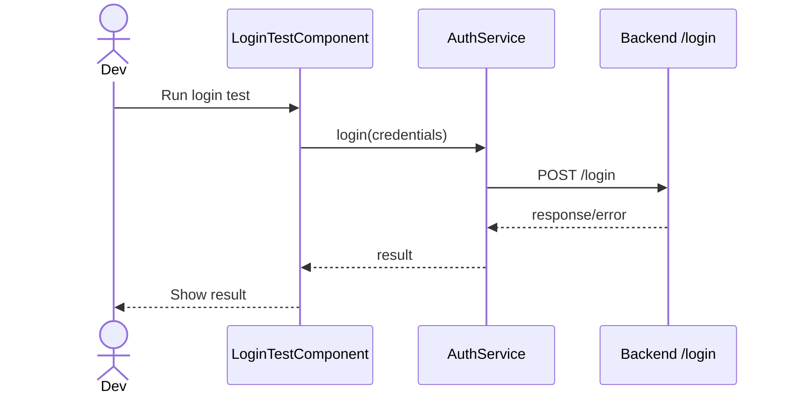

# Các màn hình kiểm thử dành cho lập trình viên

## Thông tin chung

| Route | Component | Mục tiêu |
| --- | --- | --- |
| `/api-test` | `ApiTestComponent` | Test nhanh API tạo/list bài thi |
| `/login-test` | `LoginTestComponent` | Test nhanh các case login |

## Màn hình kiểm thử API

### Hành động

- Test create exam qua `ApiService.createTest()`.
- Test list exams qua `ApiService.getTests()`.
- Xem kết quả/log trên UI console.

### Sơ đồ luồng



## Màn hình đăng nhập Test Screen

### Hành động

- Test login teacher.
- Test login student.
- Test login invalid.

### Sơ đồ luồng




## Mô tả giao diện

Hai route kỹ thuật phục vụ kiểm tra tích hợp. API Test cung cấp nút tạo/lấy danh sách bài thi và vùng log kết quả. Login Test cung cấp các nút chạy trường hợp đăng nhập giáo viên, học sinh và thông tin không hợp lệ.

## Đối chiếu production

- Đã kiểm tra ngày 28/07/2026.
- `/api-test` hiển thị đúng hai nút `Test Tạo Bài Thi` và `Test Lấy Danh Sách`.
  Chỉ tác vụ lấy danh sách được chạy; kết quả JSON hiển thị trực tiếp trên trang.
- `/login-test` hiển thị ba nút kiểm thử giáo viên, học sinh và đăng nhập sai.
  Không chạy các nút này để tránh thay đổi phiên đăng nhập đang dùng khi khảo sát.
- Đây là màn hình kỹ thuật đang public, không có guard hoặc layout điều hướng.

## Wireframe giao diện

Wireframe low-fidelity dưới đây mô tả vị trí tương đối của các vùng UI trên desktop. Trên màn hình nhỏ, các cột và card được xếp dọc theo CSS responsive hiện tại.

```text
+--------------------------------------+-----------------------------------------+
| /api-test                            | /login-test                             |
+--------------------------------------+-----------------------------------------+
| KIỂM THỬ API BÀI THI                | KIỂM THỬ ĐĂNG NHẬP                     |
| [Tạo bài thi] [Lấy danh sách]       | [Giáo viên] [Học sinh] [Sai thông tin] |
|                                      |                                         |
| +----------------------------------+ | +-------------------------------------+ |
| | Kết quả / log API               | | | Kết quả đăng nhập                  | |
| | ...                              | | | ...                                 | |
| +----------------------------------+ | +-------------------------------------+ |
+--------------------------------------+-----------------------------------------+
```

## Use case liên quan

- [UC-DEV-001: Kiểm thử API bài thi](../usecases/uc-dev-001-api-test.md)
- [UC-DEV-003: Kiểm thử đăng nhập](../usecases/uc-dev-003-login-test.md)
