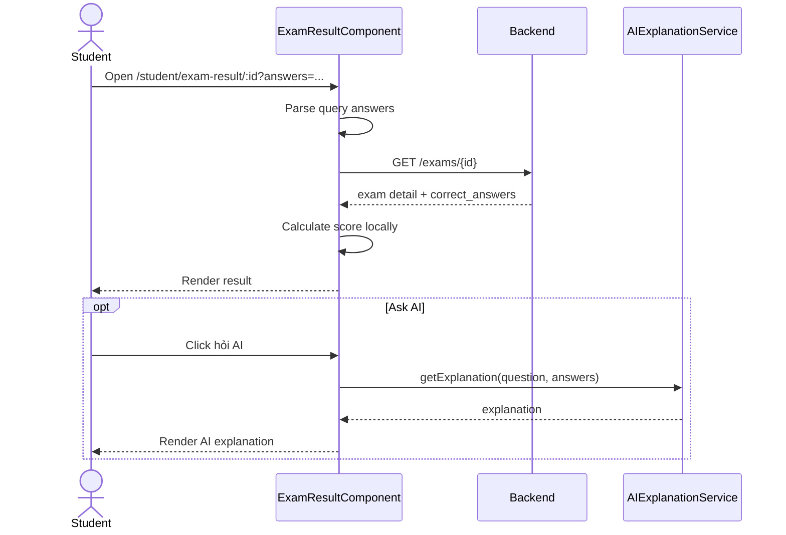

# Màn hình kết quả bài thi

## Thông tin chung

| Mục | Nội dung |
| --- | --- |
| Route | `/student/exam-result/:id` |
| Wrapper | `StudentLayoutComponent` |
| Component | `ExamResultComponent` |
| Tác nhân | Học sinh |
| Mục tiêu | Xem kết quả sau khi nộp và hỏi AI giải thích đáp án |

## Dữ liệu đầu vào từ route/query

| Input | Ghi chú |
| --- | --- |
| `id` | Exam id |
| `answers` | Chuỗi JSON chứa đáp án người dùng đã chọn |

## Thành phần giao diện

- Điểm tổng quan.
- Số câu đúng/sai.
- Chi tiết từng câu.
- Đáp án người dùng chọn.
- Đáp án đúng.
- Trạng thái đúng/sai.
- AI explanation nếu người dùng yêu cầu.

## Hành động

- Parse query `answers`.
- Load đề theo `id`.
- So sánh đáp án người dùng với `correct_answers`.
- Tính điểm local.
- Hỏi AI giải thích từng câu.
- Quay lại dashboard.
- Làm lại bài.

## Dữ liệu và API

- Load đề: `ApiService.getTestDetail(id)` -> `GET /exams/{id}`.
- AI: `AIExplanationService.getExplanation()` -> OpenAI Chat Completions.

## Rủi ro đã biết

- Kết quả hiện tính cục bộ từ query `answers` và `correct_answers`, không lấy lại
  chi tiết bài nộp từ backend.
- Route không có guard theo vai trò; khi còn phiên giáo viên, màn hình vẫn có thể
  render nếu điều hướng nội bộ tới URL kết quả hợp lệ.

## Đối chiếu production

- Đã kiểm tra ngày 28/07/2026 bằng dữ liệu đáp án rỗng, không gọi AI.
- Màn hình thực tế hiển thị tên bài, tỷ lệ phần trăm, thông điệp đánh giá, số câu
  đúng/tổng câu và ba ô tổng hợp đúng, sai, tỷ lệ.
- Mỗi câu hiển thị đáp án đúng và nút yêu cầu AI giải thích.
- Cuối trang có `Quay lại Dashboard` và `Làm lại`.

## Sơ đồ luồng




## Mô tả giao diện

Màn hình mở đầu bằng tên bài và vòng tròn phần trăm kết quả. Tiếp theo là ba ô tổng hợp đúng/sai/tỷ lệ. Mỗi câu có trạng thái màu, đáp án người dùng chọn, đáp án đúng, nút hỏi AI và vùng giải thích. Cuối trang có quay lại và làm lại.

## Wireframe giao diện

Wireframe low-fidelity dưới đây mô tả vị trí tương đối của các vùng UI trên desktop. Trên màn hình nhỏ, các cột và card được xếp dọc theo CSS responsive hiện tại.

```text
+--------------------------------------------------------------------------------+
| TÊN BÀI THI                                        +----------------------+    |
| Mô tả                                               |       80%            |    |
|                                                     |     Kết quả          |    |
|                                                     +----------------------+    |
+--------------------------------------------------------------------------------+
| +--------------------+ +--------------------+ +--------------------+            |
| | Câu đúng: 16       | | Câu sai: 4        | | Tỷ lệ đúng: 80%    |            |
| +--------------------+ +--------------------+ +--------------------+            |
+--------------------------------------------------------------------------------+
| CHI TIẾT TỪNG CÂU                                                             |
| +----------------------------------------------------------------------------+ |
| | Câu 1 [Đúng]                                                               | |
| | A. Đáp án người dùng chọn / đáp án đúng [✓]                               | |
| | B. Đáp án khác                                                             | |
| | [Hỏi AI giải thích]                                                        | |
| | +----------------------- Nội dung AI ------------------------------------+ | |
| | | ...                                                                    | | |
| | +------------------------------------------------------------------------+ | |
| +----------------------------------------------------------------------------+ |
| Câu 2 ... Câu n                                                               |
|                                             [Quay lại Dashboard] [Làm lại]     |
+--------------------------------------------------------------------------------+
```

## Use case liên quan

- [UC-STUDENT-004: Xem kết quả bài thi](../usecases/uc-student-004-view-result.md)
- [UC-STUDENT-005: Yêu cầu AI giải thích](../usecases/uc-student-005-ai-explanation.md)
