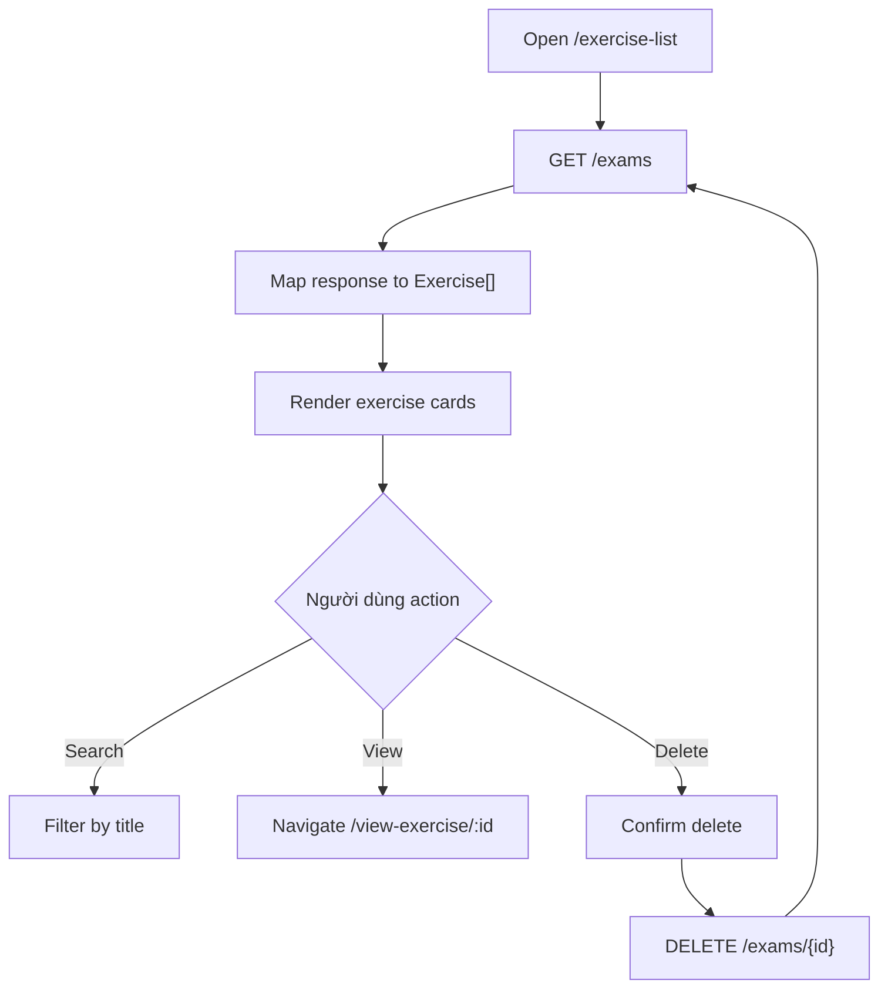

# Màn hình quản lý bài thi

## Thông tin chung

| Mục | Nội dung |
| --- | --- |
| Route | `/exercise-list` |
| Component | `ExerciseListComponent` |
| Tác nhân | Giáo viên |
| Mục tiêu | Xem, tìm kiếm, mở chi tiết và xóa bài thi |

## Thành phần giao diện

- Search input theo tên bài thi.
- Grid/card danh sách bài thi.
- Loading state.
- Empty state.
- Hai nút chuyển kiểu hiển thị `Danh sách` và `Thẻ`.
- Action đang hiển thị trên mỗi card: xem bài thi và xóa.

## Hành động

| Hành động | Kết quả |
| --- | --- |
| Load screen | Gọi `GET /exams` |
| Search | Lọc `filteredExercises` theo `title` |
| Xem bài | Navigate `/view-exercise/:id` |
| Xóa bài | Confirm, `DELETE /exams/{id}`, reload list |

## Dữ liệu và API

- `ExerciseService.loadExercisesFromServer()` -> `GET /exams`.
- `ExerciseService.deleteExercise(id)` -> `DELETE /exams/{id}`.

## Đối chiếu production

- Đã kiểm tra ngày 28/07/2026 với tài khoản giáo viên.
- Mỗi card thực tế hiển thị tên bài, số câu hỏi, trạng thái `Đã xuất bản`, nút
  `Xem bài thi` và nút `Xóa`.
- Giao diện không có nút báo cáo trên card. Báo cáo được truy cập từ mục `Báo cáo`
  trên header.
- Source vẫn còn `viewReport()` điều hướng `/exam-report/:id`, nhưng hàm này
  không có lối kích hoạt trên giao diện hiện tại và route đích chưa tồn tại.

## Sơ đồ luồng




## Mô tả giao diện

Màn hình quản lý có header giáo viên, tiêu đề trang, ô tìm kiếm và vùng danh sách bài thi dạng card. Mỗi card cung cấp các thao tác xem/xóa; màn hình có trạng thái đang tải và trạng thái rỗng với CTA tạo bài đầu tiên.

## Wireframe giao diện

Wireframe low-fidelity dưới đây mô tả vị trí tương đối của các vùng UI trên desktop. Trên màn hình nhỏ, các cột và card được xếp dọc theo CSS responsive hiện tại.

```text
+--------------------------------------------------------------------------------+
| Header giáo viên                                                               |
+--------------------------------------------------------------------------------+
| QUẢN LÝ BÀI TẬP TRẮC NGHIỆM                                                   |
| Tạo, chỉnh sửa và theo dõi các bài tập                                         |
+--------------------------------------------------------------------------------+
| Tìm kiếm bài tập                                      [Xóa tìm kiếm]          |
| [🔍 Nhập tên bài tập để tìm kiếm___________________________________________]  |
+--------------------------------------------------------------------------------+
| Danh sách bài tập ({n})                              [Danh sách] [Thẻ]         |
| +----------------------+ +----------------------+ +----------------------+     |
| | Tên bài 1            | | Tên bài 2            | | Tên bài 3            |     |
| | Metadata / trạng thái| | Metadata / trạng thái| | Metadata / trạng thái|     |
| | [Xem]          [Xóa] | | [Xem]          [Xóa] | | [Xem]          [Xóa] |     |
| +----------------------+ +----------------------+ +----------------------+     |
|                                                                                |
| Trạng thái thay thế: [Đang tải...] hoặc [Chưa có bài - Tạo bài đầu tiên]      |
+--------------------------------------------------------------------------------+
| Footer                                                                         |
+--------------------------------------------------------------------------------+
```

## Use case liên quan

- [UC-TEACHER-005: Xem danh sách bài thi](../usecases/uc-teacher-005-list-exams.md)
- [UC-TEACHER-007: Xóa bài thi](../usecases/uc-teacher-007-delete-exam.md)
