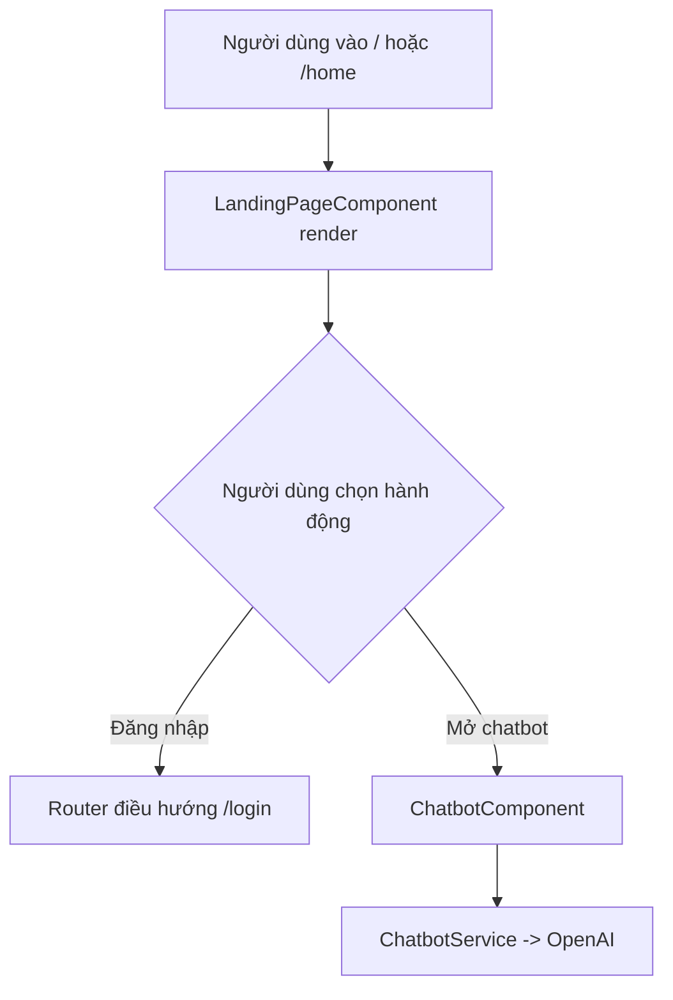

# Màn hình trang giới thiệu

## Thông tin chung

| Mục | Nội dung |
| --- | --- |
| Route | `/`, `/home` |
| Component | `LandingPageComponent` |
| Tác nhân | Khách, giáo viên, học sinh |
| Mục tiêu | Giới thiệu ứng dụng và đưa người dùng tới luồng đăng nhập |

## Thành phần giao diện

- Brand/giới thiệu ứng dụng Sinh học.
- CTA đăng nhập.
- Các khối giới thiệu học Sinh học, AI và chương trình THPT.
- `ChatbotComponent` có thể được render ở landing.

## Hành động

| Hành động | Kết quả |
| --- | --- |
| Bấm đăng nhập | Navigate `/login` |
| Mở chatbot | Mở panel hỏi đáp AI |
| Gửi tin nhắn chatbot | Gọi `ChatbotService.sendMessage()` |

## Dữ liệu và API

- Landing content không gọi backend.
- Chatbot nếu được dùng sẽ gọi OpenAI trực tiếp qua `ChatbotService`.

## Đối chiếu production

- Đã kiểm tra ngày 28/07/2026 tại `/`.
- Header thực tế hiển thị logo, tên “Sinh học cùng cô Thảo”, mô tả ngắn và nút
  `Đăng nhập`.
- Nội dung chính có khối giới thiệu BioEduTech, các tính năng AI và ba khối
  chương trình lớp 10, 11, 12.
- Không gửi tin nhắn BioBot trong lần kiểm tra vì chức năng này cần API key/quota.

## Sơ đồ luồng




## Mô tả giao diện

Trang công khai có header chứa logo và nút Đăng nhập. Phần nội dung lần lượt gồm khối chào mừng BioEduTech, minh họa Sinh học/AI, thẻ giới thiệu tính năng và ba thẻ chương trình lớp 10, 11, 12. Nút chatbot nổi ở góc màn hình mở panel hội thoại.

## Wireframe giao diện

Wireframe low-fidelity dưới đây mô tả vị trí tương đối của các vùng UI trên desktop. Trên màn hình nhỏ, các cột và card được xếp dọc theo CSS responsive hiện tại.

```text
+--------------------------------------------------------------------------------+
| [Logo] Sinh học cùng cô Thảo                                  [Đăng nhập]      |
+--------------------------------------------------------------------------------+
|                         CHÀO MỪNG ĐẾN BIOEDUTECH                         [Chat] |
|                    Nền tảng học tập thông minh với AI                         |
+--------------------------------------+-----------------------------------------+
|                                      | Học Sinh học thông minh hơn với AI      |
|        Minh họa Sinh học / AI        | [AI giải thích] [Tài liệu] [Bài tập]    |
|                                      |                                         |
+--------------------------------------+-----------------------------------------+
|                         CHƯƠNG TRÌNH SINH HỌC THPT                            |
|     +----------------+     +----------------+     +----------------+            |
|     |     LỚP 10     |     |     LỚP 11     |     |     LỚP 12     |            |
|     | Danh sách chủ  |     | Danh sách chủ  |     | Danh sách chủ  |            |
|     | đề             |     | đề             |     | đề             |            |
|     +----------------+     +----------------+     +----------------+            |
+--------------------------------------------------------------------------------+
| Footer                                                                         |
+--------------------------------------------------------------------------------+
```

## Use case liên quan

- [UC-GUEST-001: Xem trang giới thiệu](../usecases/uc-guest-001-view-landing.md)
- [UC-STUDENT-006: Trò chuyện với BioBot](../usecases/uc-student-006-chatbot.md)
