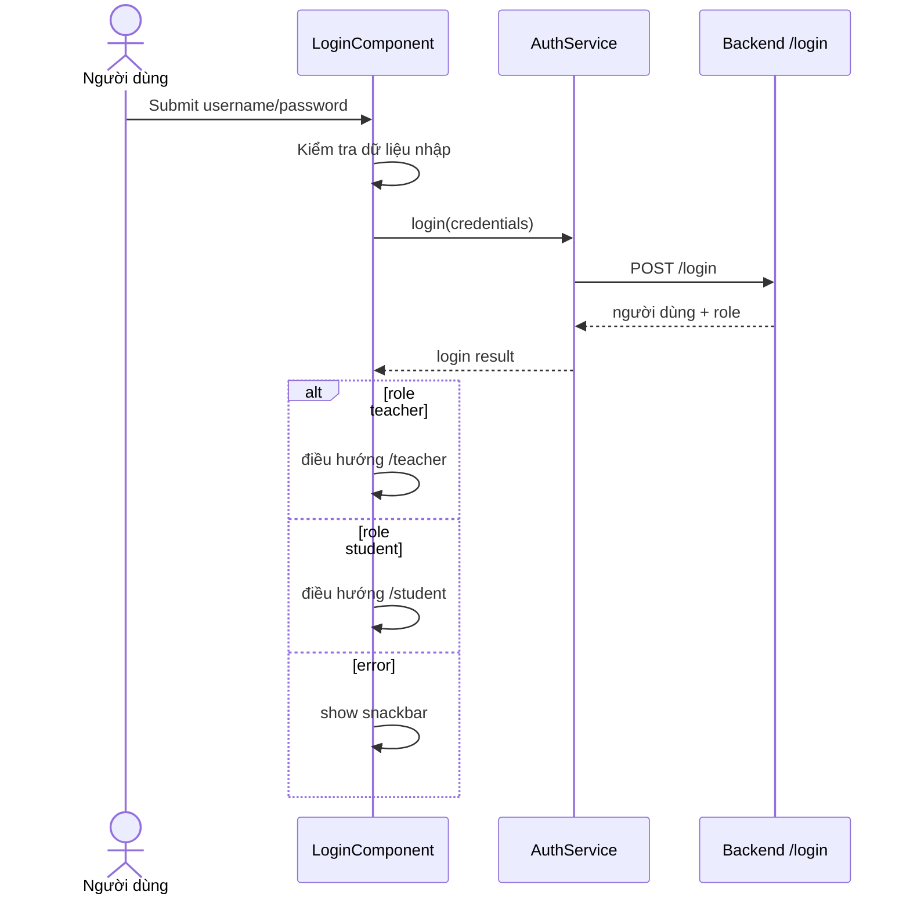

# Màn hình đăng nhập

## Thông tin chung

| Mục | Nội dung |
| --- | --- |
| Route | `/login` |
| Component | `LoginComponent` |
| Tác nhân | Giáo viên, học sinh |
| Mục tiêu | Xác thực người dùng và điều hướng theo role |

## Dữ liệu đầu vào

| Field | Bắt buộc | Ghi chú |
| --- | --- | --- |
| `username` | Có | Tên đăng nhập trên backend |
| `password` | Có | Mật khẩu người dùng |

## Hành động

- Gửi biểu mẫu login.
- Validate username/password không rỗng.
- Gọi `AuthService.login(credentials)`.
- Role `teacher` điều hướng `/teacher`.
- Role `student` điều hướng `/student`.
- Lỗi validate/API hiện snackbar.

## Dữ liệu và API

```text
LoginComponent
  -> AuthService.login()
  -> ApiService.loginStudent()
  -> POST /login
```

## Trạng thái

- `username`
- `password`
- `isLoading`

## Đối chiếu production

- Đã đăng nhập thành công bằng cả tài khoản học sinh và giáo viên ngày 28/07/2026.
- Form thực tế là một thẻ ở giữa màn hình, gồm logo, ô tên đăng nhập, ô mật khẩu
  và nút `Đăng nhập`.
- Sau khi xác thực, học sinh được chuyển tới `/student`, giáo viên tới `/teacher`.

## Sơ đồ luồng




## Mô tả giao diện

Màn hình toàn trang với nền trang trí và một thẻ đăng nhập đặt ở trung tâm. Thẻ gồm logo, lời chào, ô tên đăng nhập, ô mật khẩu và nút Đăng nhập. Khi gửi form, nút bị vô hiệu hóa và đổi sang trạng thái đang xử lý.

## Wireframe giao diện

Wireframe low-fidelity dưới đây mô tả vị trí tương đối của các vùng UI trên desktop. Trên màn hình nhỏ, các cột và card được xếp dọc theo CSS responsive hiện tại.

```text
+--------------------------------------------------------------------------------+
|                                                                                |
|                         +--------------------------------+                     |
|                         | [Logo] Sinh học cùng cô Thảo   |                     |
|                         |                                |                     |
|                         |      CHÀO MỪNG TRỞ LẠI         |                     |
|                         |                                |                     |
|                         | [icon] Tên đăng nhập           |                     |
|                         | [__________________________]   |                     |
|                         |                                |                     |
|                         | [icon] Mật khẩu                |                     |
|                         | [__________________________]   |                     |
|                         |                                |                     |
|                         | [       ĐĂNG NHẬP          ]   |                     |
|                         +--------------------------------+                     |
|                                                                                |
+--------------------------------------------------------------------------------+
```

## Use case liên quan

- [UC-GUEST-002: Đăng nhập](../usecases/uc-guest-002-login.md)
