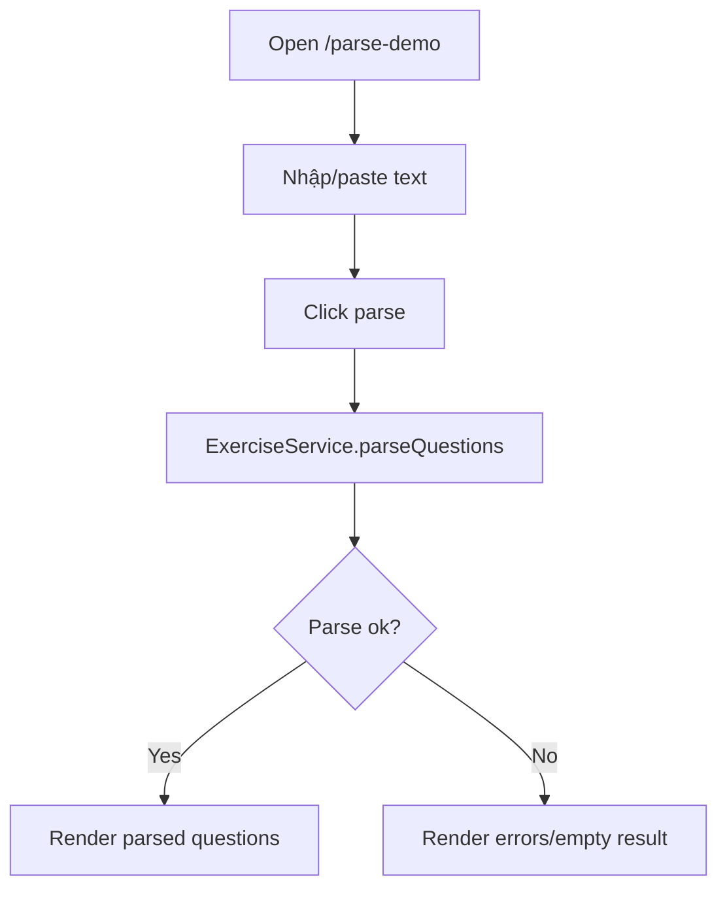

# Màn hình thử nghiệm bộ phân tích câu hỏi

## Thông tin chung

| Mục | Nội dung |
| --- | --- |
| Route | `/parse-demo` |
| Component | `ParseDemoComponent` |
| Tác nhân | Developer, giáo viên khi test parser |
| Mục tiêu | Demo logic parse câu hỏi từ text |

## Thành phần giao diện

- Text area nhập nội dung câu hỏi.
- Các nút `Parse Câu Hỏi`, `Load Mẫu`, `Xóa`.
- Kết quả parse thành danh sách câu hỏi/đáp án.
- Error/diagnostic nếu parse không đúng format.

## Dữ liệu và API

- `ExerciseService.parseQuestions()`.
- Không gọi backend.

## Đối chiếu production

- Đã kiểm tra ngày 28/07/2026.
- `Load Mẫu` điền ba câu hỏi; `Parse Câu Hỏi` trả về ba khối kết quả.
- Kết quả hiển thị nhãn `Single Choice`/`Multiple Choice` và đánh dấu từng đáp án đúng.
- Màn hình không có header/footer nghiệp vụ và không lưu dữ liệu.

## Sơ đồ luồng




## Mô tả giao diện

Màn hình kỹ thuật tối giản gồm vùng nhập văn bản câu hỏi, nút chạy parser, vùng báo lỗi và vùng kết quả hiển thị cấu trúc câu hỏi/đáp án đã phân tích.

## Wireframe giao diện

Wireframe low-fidelity dưới đây mô tả vị trí tương đối của các vùng UI trên desktop. Trên màn hình nhỏ, các cột và card được xếp dọc theo CSS responsive hiện tại.

```text
+--------------------------------------------------------------------------------+
| PARSE DEMO                                                                     |
+--------------------------------------------------------------------------------+
| Nhập câu hỏi theo định dạng:                                                   |
| +----------------------------------------------------------------------------+ |
| | Câu hỏi?                                                                   | |
| | a) Đáp án A                                                               | |
| | b) Đáp án B (đúng)                                                        | |
| +----------------------------------------------------------------------------+ |
| [Parse Câu Hỏi] [Load Mẫu] [Xóa]                                              |
+--------------------------------------------------------------------------------+
| LỖI PHÂN TÍCH (nếu có)                                                        |
| - ...                                                                          |
+--------------------------------------------------------------------------------+
| KẾT QUẢ                                                                        |
| Câu 1                                                                          |
|   A. Đáp án A                                                                  |
|   B. Đáp án B [Đúng]                                                           |
+--------------------------------------------------------------------------------+
```

## Use case liên quan

- [UC-DEV-002: Kiểm thử bộ phân tích câu hỏi](../usecases/uc-dev-002-parse-demo.md)
