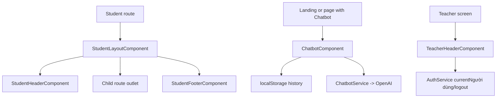

# Bố cục và tiện ích dùng chung

## Thành phần

| Component | Tác nhân | Mục tiêu |
| --- | --- | --- |
| `TeacherHeaderComponent` | Giáo viên | Điều hướng chung cho màn hình giáo viên |
| `StudentLayoutComponent` | Học sinh | Wrapper header/footer cho route học sinh |
| `StudentHeaderComponent` | Học sinh | Navigation và logout |
| `StudentFooterComponent` | Học sinh | Footer và shortcut điều hướng |
| `ChatbotComponent` | Mỗi người dùng nơi component được gắn | Chat hỏi đáp Sinh học với AI |
| `LayoutComponent` | Legacy | Layout tổng quát cũ, không phải wrapper chính hiện tại |

## Header giáo viên

- Logo.
- Navigation đang hiển thị: bài tập, tạo bài, học sinh, báo cáo.
- Người dùng section và logout.
- Subscribe `AuthService.currentNgười dùng$`.

## Bố cục, header và footer học sinh

- Bọc các child route trong nhóm student.
- Header hiển thị logo, nhãn `Student` và đăng xuất.
- Footer có shortcut và scroll to top.

## Chatbot

- Floating chat button.
- Chat panel.
- Message list.
- Input message.
- Loading state.
- Lưu/restore history từ localStorage.
- Gọi `ChatbotService.sendMessage()` -> OpenAI Chat Completions.

## Đối chiếu production

- Header giáo viên thực tế không có mục dashboard; logo có thể đưa người dùng về
  trang tổng quan bằng xử lý trong component.
- Header học sinh trên màn làm bài hiển thị logo, nhãn `Student` và nút đăng xuất.
- Không kiểm tra gửi tin nhắn chatbot vì chức năng AI cần API key/quota.

## Sơ đồ luồng




## Mô tả giao diện

Các thành phần dùng chung tạo khung điều hướng cho giáo viên/học sinh và chatbot nổi. Header hiển thị logo, menu theo vai trò và đăng xuất; StudentLayout bọc router outlet cùng footer; chatbot mở thành panel có lịch sử tin nhắn, ô nhập và trạng thái đang trả lời.

## Wireframe giao diện

Wireframe low-fidelity dưới đây mô tả vị trí tương đối của các vùng UI trên desktop. Trên màn hình nhỏ, các cột và card được xếp dọc theo CSS responsive hiện tại.

```text
+--------------------------------------------------------------------------------+
| HEADER THEO VAI TRÒ                                                            |
| [Logo] [Bài tập] [Tạo bài] [Học sinh] [Báo cáo]        [Tài khoản] [Đăng xuất]|
+--------------------------------------------------------------------------------+
|                                                                                |
|                        <router-outlet>                                          |
|                        Màn hình nghiệp vụ                                      |
|                                                                                |
|                                                                      [Chat]    |
+--------------------------------------------------------------------------------+
| FOOTER: liên kết nhanh                                              [Lên đầu]  |
+--------------------------------------------------------------------------------+

Khi mở chatbot:

                                                        +-----------------------+
                                                        | BioBot            [x]|
                                                        +-----------------------+
                                                        | AI: Xin chào...       |
                                                        | Bạn: Câu hỏi...       |
                                                        | AI: ...               |
                                                        +-----------------------+
                                                        | [Nhập tin nhắn] [Gửi] |
                                                        +-----------------------+
```

## Use case liên quan

- [UC-STUDENT-006: Trò chuyện với BioBot](../usecases/uc-student-006-chatbot.md)
