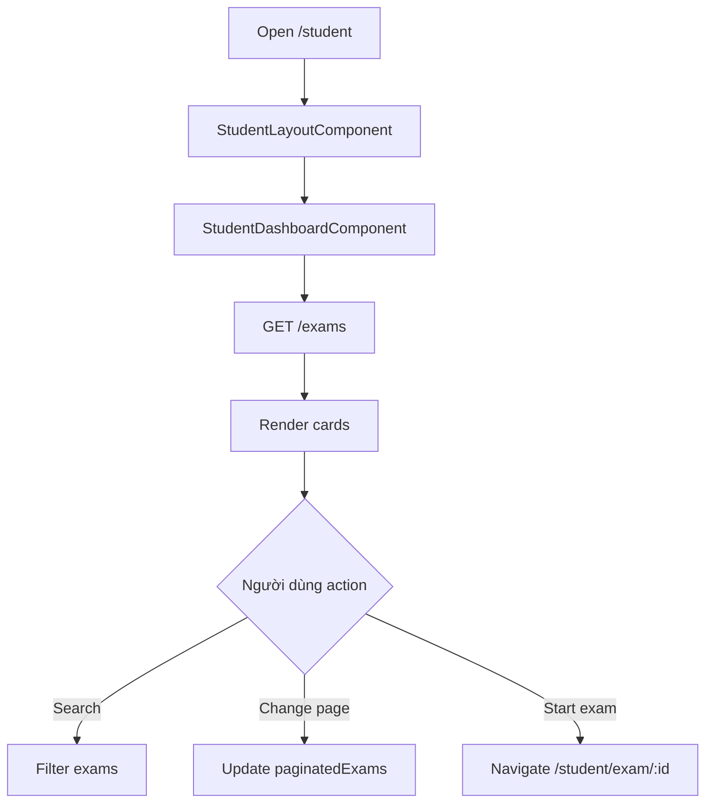

# Màn hình danh sách bài thi của học sinh

## Thông tin chung

| Mục | Nội dung |
| --- | --- |
| Route | `/student`, `/student/dashboard`, `/student-dashboard` |
| Wrapper | `StudentLayoutComponent` |
| Component | `StudentDashboardComponent` |
| Tác nhân | Học sinh |
| Mục tiêu | Xem danh sách bài thi và bắt đầu làm bài |

## Thành phần giao diện

- Tiêu đề danh sách bài thi.
- Search theo `exam_name`.
- Card bài thi.
- Pagination client-side.
- Loading/error/trạng thái rỗng.

## Hành động

- Load danh sách exams.
- Search.
- Clear search.
- Chuyển trang.
- Click bài thi hoặc bấm bắt đầu để vào `/student/exam/:id`.

## Dữ liệu và API

- `ApiService.getTests(1, 1000)` -> `GET /exams`.

## Trạng thái

- `exams`
- `filteredExams`
- `paginatedExams`
- `loading`
- `error`
- `currentPage`
- `itemsPerPage`
- `searchText`

## Đối chiếu production

- Đã kiểm tra ngày 28/07/2026 bằng tài khoản học sinh.
- Header thực tế hiển thị logo, tên “Sinh học cùng cô Thảo”, nhãn `Student` và
  nút đăng xuất.
- Production hiện có 5 card. Mỗi card chỉ hiển thị tên bài, `22 câu hỏi` và nút
  `Bắt đầu làm bài` vì response danh sách chỉ có `id`, `exam_name`,
  `question_count`.
- Các trường trạng thái, thời gian, điểm, lớp và ngày bắt đầu/kết thúc chỉ render
  khi API trả dữ liệu tương ứng; chúng không xuất hiện trong lần kiểm tra.
- Tìm kiếm lọc danh sách ngay khi nhập, có nút xóa và trạng thái không tìm thấy.
- Phân trang cục bộ dùng 10 bài/trang; với 5 bài hiện tại, thanh phân trang không
  xuất hiện.

## Sơ đồ luồng




## Mô tả giao diện

Màn hình nằm trong `StudentLayoutComponent`. Nội dung gồm tiêu đề danh sách bài
thi, ô tìm kiếm và lưới card. Card luôn hiển thị tên, số câu và nút bắt đầu; trạng
thái, thời gian, điểm, lớp và thời hạn chỉ xuất hiện khi API danh sách trả các
trường đó. Phân trang chỉ xuất hiện khi có trên 10 kết quả.

## Wireframe giao diện

Wireframe low-fidelity dưới đây mô tả vị trí tương đối của các vùng UI trên desktop. Trên màn hình nhỏ, các cột và card được xếp dọc theo CSS responsive hiện tại.

```text
+--------------------------------------------------------------------------------+
| [Logo] Sinh học cùng cô Thảo                       [Student] [Đăng xuất]       |
+--------------------------------------------------------------------------------+
| DANH SÁCH BÀI THI                                                            |
| Chọn bài thi bạn muốn làm                                                     |
| [🔍 Tìm kiếm bài thi theo tên________________________________________] [x]    |
+--------------------------------------------------------------------------------+
| +----------------------+ +----------------------+ +----------------------+     |
| | Tên bài 1            | | Tên bài 2            | | Tên bài 3            |     |
| | 22 câu hỏi           | | 22 câu hỏi           | | 22 câu hỏi           |     |
| | [Bắt đầu làm bài]    | | [Bắt đầu làm bài]    | | [Bắt đầu làm bài]    |     |
| +----------------------+ +----------------------+ +----------------------+     |
|                                                                                |
| Khi có trên 10 bài:       [‹ Trước] [1] [2] [3] [Sau ›]                       |
+--------------------------------------------------------------------------------+
| Footer học sinh                                                               |
+--------------------------------------------------------------------------------+
```

## Use case liên quan

- [UC-STUDENT-001: Xem danh sách bài thi](../usecases/uc-student-001-list-exams.md)
