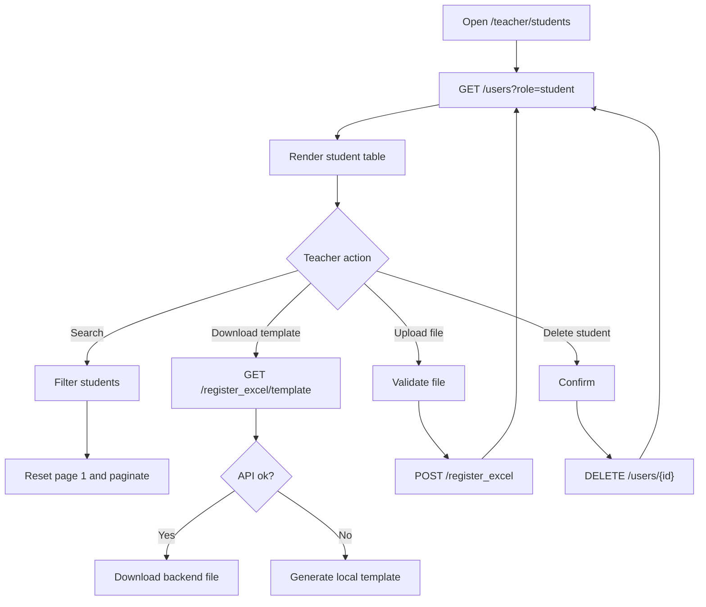

# Màn hình quản lý học sinh

## Thông tin chung

| Mục | Nội dung |
| --- | --- |
| Route | `/teacher/students` |
| Component | `StudentManagementComponent` |
| Tác nhân | Giáo viên |
| Mục tiêu | Quản lý danh sách học sinh và import học sinh bằng file |

## Thành phần giao diện

- Khu vực upload Excel/CSV.
- Nút tải template.
- Search học sinh.
- Bảng danh sách học sinh.
- Menu action từng học sinh.

## Hành động

- Drag/drop file.
- Chọn file.
- Validate extension/size.
- Upload file.
- Download template.
- Search học sinh.
- Delete học sinh.
- Edit học sinh hiện chỉ snackbar/TODO.

## Dữ liệu và API

- Load students: `ApiService.getStudents()` -> `GET /users?role=student`.
- Upload Excel: `ExcelService.registerStudentsFromExcel()` -> `POST /register_excel`.
- Download template: `GET /register_excel/template`, fallback tạo local template.
- Delete: `DELETE /users/{id}`.

## Trạng thái

- `selectedFile`
- `isDragOver`
- `isUploading`
- `students`
- `filteredStudents`
- `paginatedStudents`
- `searchTerm`
- `isLoading`
- `currentPage`
- `itemsPerPage`

## Đối chiếu production

- Đã kiểm tra ngày 28/07/2026 với tài khoản giáo viên, không upload hoặc xóa dữ liệu.
- Vùng import ghi rõ chấp nhận Excel/CSV, cấu trúc cột họ tên, tên đăng nhập,
  mật khẩu và giới hạn file 10 MB.
- Bảng thực tế có các cột họ tên, tên đăng nhập và thao tác; menu ba chấm gồm
  `Chỉnh sửa` và `Xóa`.
- `Chỉnh sửa` hiện mới thông báo/TODO trong code.
- Tại thời điểm đối chiếu production có 199 học sinh. Sau đợt cập nhật hiện tại,
  frontend phân trang cục bộ với mặc định 20 dòng/trang và cho chọn 10, 20 hoặc
  50 dòng.

## Sơ đồ luồng




## Mô tả giao diện

Header giáo viên và tiêu đề trang nằm trên cùng, kèm nút tải template. Nội dung chính gồm thẻ upload hỗ trợ kéo-thả/chọn file và thẻ danh sách học sinh có ô tìm kiếm, bảng họ tên/tên đăng nhập/thao tác. Menu ba chấm chứa sửa và xóa.

## Wireframe giao diện

Wireframe low-fidelity dưới đây mô tả vị trí tương đối của các vùng UI trên desktop. Trên màn hình nhỏ, các cột và card được xếp dọc theo CSS responsive hiện tại.

```text
+--------------------------------------------------------------------------------+
| Header giáo viên                                                               |
+--------------------------------------------------------------------------------+
| QUẢN LÝ HỌC SINH                                  [Tải template Excel]        |
| Thêm và quản lý tài khoản học sinh                                             |
+--------------------------------------------------------------------------------+
| TẢI LÊN EXCEL / CSV                                                           |
| +----------------------------------------------------------------------------+ |
| |                       Kéo thả file vào đây                                 | |
| |                         hoặc [Chọn file]                                   | |
| +----------------------------------------------------------------------------+ |
| File đã chọn: students.xlsx                              [x]                   |
|                                                     [Upload file] [Hủy]       |
+--------------------------------------------------------------------------------+
| DANH SÁCH HỌC SINH ({n})                                                      |
| [🔍 Tìm theo tên, username, email__________________________________________]  |
| +-------------------------------+----------------------+---------------------+ |
| | Họ tên                        | Tên đăng nhập       | Thao tác            | |
| +-------------------------------+----------------------+---------------------+ |
| | Nguyễn Văn A                  | student01           | [⋮ Sửa / Xóa]       | |
| | ...                           | ...                 | [⋮]                 | |
| +-------------------------------+----------------------+---------------------+ |
| Hiển thị 1-20 trong {n} học sinh    Số dòng [20 v]  Trang 1/{m} [|<][<][>][>|]|
+--------------------------------------------------------------------------------+
| Footer                                                                         |
+--------------------------------------------------------------------------------+
```

## Use case liên quan

- [UC-TEACHER-008: Quản lý học sinh](../usecases/uc-teacher-008-manage-students.md)
- [UC-TEACHER-009: Import học sinh](../usecases/uc-teacher-009-import-students.md)
- [UC-TEACHER-010: Tải file mẫu](../usecases/uc-teacher-010-download-student-template.md)
- [UC-TEACHER-011: Xóa học sinh](../usecases/uc-teacher-011-delete-student.md)
