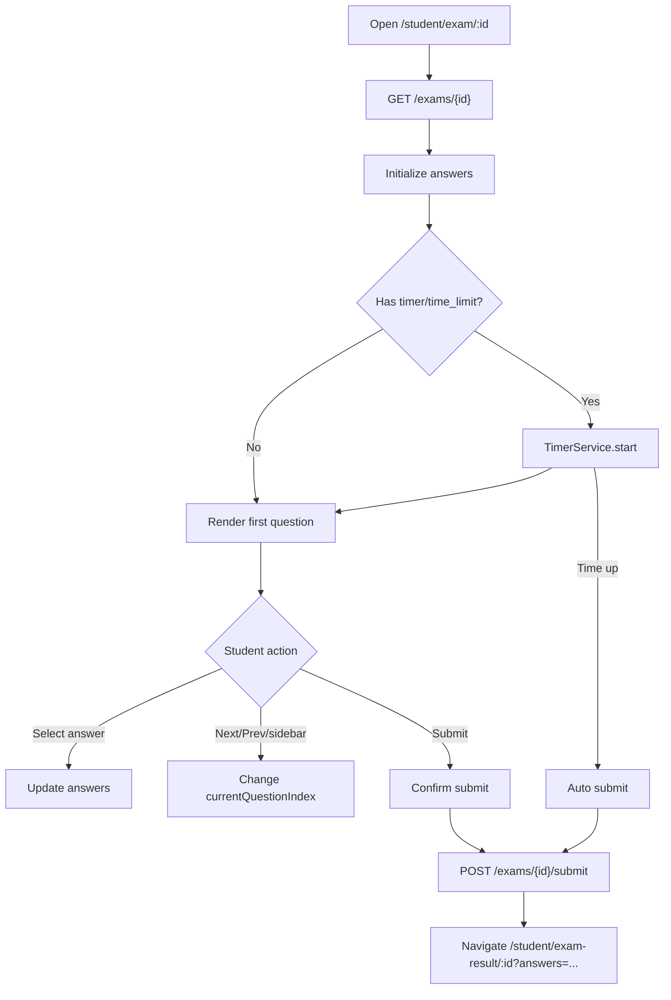

# Màn hình làm bài thi

## Thông tin chung

| Mục | Nội dung |
| --- | --- |
| Route | `/student/exam/:id` |
| Wrapper | `StudentLayoutComponent` |
| Component | `TakeExamComponent` |
| Tác nhân | Học sinh |
| Mục tiêu | Làm bài thi và nộp bài |

## Thành phần giao diện

- Thông tin bài thi.
- Timer nếu bài thi có `timer` hoặc `time_limit`.
- Câu hỏi hiện tại.
- Đáp án radio/checkbox.
- Sidebar số câu.
- Nút trước/sau/nộp bài.

## Hành động

- Load bài thi theo `id`.
- Khởi tạo answers rỗng.
- Khởi tạo timer.
- Chọn/bỏ chọn đáp án.
- Chuyển câu hỏi.
- Nộp thủ công có xác nhận.
- Tự nộp khi hết giờ.
- Quay lại dashboard có xác nhận.

## Dữ liệu và API

- Load đề: `ApiService.getTestDetail(id)` -> `GET /exams/{id}`.
- Submit: `ApiService.submitExam(id, data)` -> `POST /exams/{id}/submit`.
- Timer: `TimerService`.

## Request nộp bài

```json
{
  "student_id": 1,
  "answers": [[1], [0, 2]],
  "time_taken": 120
}
```

## Rủi ro đã biết

- API load đề hiện trả `correct_answers`; đáp án đúng có mặt trên client trong lúc học sinh làm bài.
- `student_id` có fallback `1` nếu không lấy được auth student.

## Đối chiếu production

- Đã kiểm tra ngày 28/07/2026 với tài khoản học sinh, chỉ chọn đáp án cục bộ và
  không nộp bài.
- Bài được kiểm tra có 22 câu và timer 30 phút; đồng hồ bắt đầu đếm ngay khi đề tải.
- Thanh tiến độ tăng từ `0/22` lên `1/22` sau khi chọn đáp án. Sidebar hiển thị
  đủ số câu và cho phép chuyển câu.
- Các thao tác hiển thị đúng gồm `Nộp bài thi`, `Quay về trang chủ`, `Câu trước`
  và `Câu sau`.

## Sơ đồ luồng




## Mô tả giao diện

Phần đầu hiển thị tên bài, số câu và đồng hồ đếm ngược. Thanh tiến độ cho biết số
câu đã trả lời. Thân trang chia hai cột: sidebar điều hướng câu hỏi ở trái và nội
dung câu hỏi/đáp án ở phải. Cuối trang có nộp bài, về trang chủ và điều hướng
trước/sau.

## Wireframe giao diện

Wireframe low-fidelity dưới đây mô tả vị trí tương đối của các vùng UI trên desktop. Trên màn hình nhỏ, các cột và card được xếp dọc theo CSS responsive hiện tại.

```text
+--------------------------------------------------------------------------------+
| TÊN BÀI THI                       22 câu                    [00:24:18]          |
+--------------------------------------------------------------------------------+
| Tiến độ: [██████████████████----------------------] 8 / 22 câu đã trả lời     |
+----------------------+---------------------------------------------------------+
| [‹]              [›] | CÂU 9: Nội dung câu hỏi                                |
|                      |                                                         |
| [1] [2] [3] [4] [5]  | +---------------- Ảnh câu hỏi ----------------+         |
| [6] [7] [8] [9] [10] | |                                                  |   |
| [11][12][13][14][15]  | +--------------------------------------------------+   |
| [16][17][18][19][20]  |                                                         |
|                      | ( ) A. Nội dung đáp án                                  |
| Đã trả lời: màu xanh | ( ) B. Nội dung đáp án                                  |
| Đang xem: nổi bật    | ( ) C. Nội dung đáp án                                  |
+----------------------+---------------------------------------------------------+
| [Nộp bài thi] [Về trang chủ]              [← Câu trước] [Câu sau →]          |
+--------------------------------------------------------------------------------+
```

## Use case liên quan

- [UC-STUDENT-002: Làm bài thi](../usecases/uc-student-002-take-exam.md)
- [UC-STUDENT-003: Làm bài có giới hạn thời gian](../usecases/uc-student-003-timed-exam.md)
