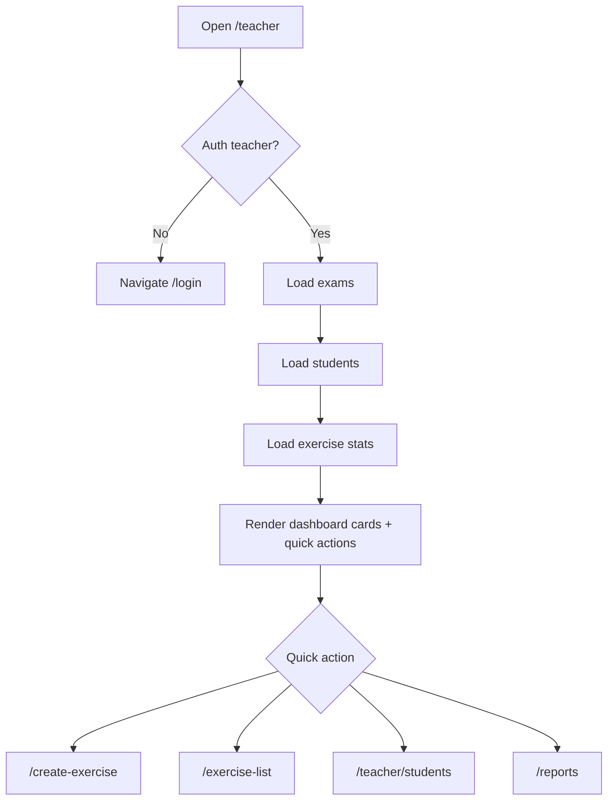

# Màn hình tổng quan giáo viên

## Thông tin chung

| Mục | Nội dung |
| --- | --- |
| Route | `/teacher`, `/teacher-dashboard` |
| Component | `TeacherDashboardComponent` |
| Tác nhân | Giáo viên |
| Mục tiêu | Xem tổng quan lớp, bài thi và vào nhanh các nghiệp vụ giáo viên |

## Điều kiện truy cập

- `AuthService.getCurrentTeacher()` phải trả người dùng role `teacher`.
- Nếu không có teacher hợp lệ, component điều hướng `/login`.

## Thành phần giao diện

- Lời chào giáo viên, bộ môn và trường học.
- Tổng số học sinh.
- Tổng số bài thi/bài tập.
- Khối giới thiệu quản lý lớp học.
- Thao tác nhanh: tạo bài, danh sách bài thi, quản lý học sinh, báo cáo.

## Hành động

| Hành động | Route/API |
| --- | --- |
| Tạo bài thi | `/create-exercise` |
| Quản lý bài thi | `/exercise-list` |
| Quản lý học sinh | `/teacher/students` |
| Xem báo cáo | `/reports` |
| Đăng xuất | Clear auth, điều hướng `/` |

## Dữ liệu và API

- `ApiService.getTests(1, 100)`
- `ApiService.getStudents(1, 100)`
- `ExerciseService.getExerciseStats()`

## Trạng thái

- `currentTeacher`
- `totalStudents`
- `totalAssignments`
- `isLoadingStats`
- `isLoadingStudents`
- `isLoadingExams`

## Đối chiếu production

- Đã kiểm tra ngày 28/07/2026 bằng tài khoản giáo viên.
- Header thực tế có các mục `Bài tập`, `Tạo bài`, `Học sinh`, `Báo cáo`, thông
  tin “Cô giáo”, vai trò `GIÁO VIÊN` và nút đăng xuất; không có mục dashboard.
- Nội dung hiển thị lời chào, bộ môn/trường, khối “Quản lý lớp học thông minh”,
  hai thẻ thống kê và bốn nút thao tác nhanh.
- Tại thời điểm kiểm tra, UI hiển thị `205` tổng số học sinh và `5` bài tập đã tạo.
- Số `205` chưa đáng tin cậy: component lấy trực tiếp `response.count`, trong khi
  response của `GET /users?page=1&limit=100&role=student` vẫn chứa giáo viên và
  các role cũ. Đây là lệch dữ liệu backend/frontend, không phải tổng học sinh đã lọc.
- `ExerciseService.getExerciseStats()` vẫn được gọi nhưng UI hiện chỉ dùng hai số
  tổng từ API học sinh và bài thi.

## Sơ đồ luồng




## Mô tả giao diện

Header giáo viên nằm trên cùng. Nội dung có lời chào theo tên giáo viên, khối minh họa và giới thiệu chức năng, hai thẻ thống kê tổng học sinh/tổng bài tập, sau đó là bốn nút thao tác nhanh.

## Wireframe giao diện

Wireframe low-fidelity dưới đây mô tả vị trí tương đối của các vùng UI trên desktop. Trên màn hình nhỏ, các cột và card được xếp dọc theo CSS responsive hiện tại.

```text
+--------------------------------------------------------------------------------+
| [Logo]  Bài tập | Tạo bài | Học sinh | Báo cáo       [Cô giáo] [Đăng xuất] |
+--------------------------------------------------------------------------------+
| Xin chào, {Tên giáo viên}!                                                     |
| {Bộ môn} - {Trường học}                                                        |
+--------------------------------------+-----------------------------------------+
|       Minh họa giáo viên             | Quản lý lớp học thông minh              |
|                                      | [Tạo bài] [Học sinh] [Theo dõi]         |
+--------------------------------------+-----------------------------------------+
| THỐNG KÊ NHANH                                                                 |
| +----------------------------+     +----------------------------+               |
| | Tổng số học sinh: {n}      |     | Bài tập đã tạo: {n}        |               |
| +----------------------------+     +----------------------------+               |
| THAO TÁC NHANH                                                                |
| [Tạo bài tập] [Quản lý bài tập] [Quản lý học sinh] [Xem báo cáo]              |
+--------------------------------------------------------------------------------+
| Footer                                                                         |
+--------------------------------------------------------------------------------+
```

## Use case liên quan

- [UC-TEACHER-001: Xem tổng quan giáo viên](../usecases/uc-teacher-001-view-dashboard.md)
