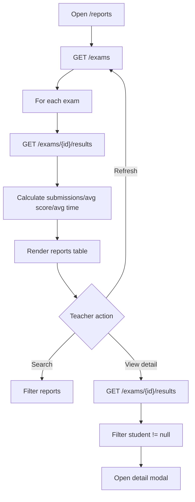

# Màn hình báo cáo giáo viên

## Thông tin chung

| Mục | Nội dung |
| --- | --- |
| Route | `/reports` |
| Component | `TeacherReportsComponent` |
| Tác nhân | Giáo viên |
| Mục tiêu | Xem thống kê submission theo từng bài thi |

## Thành phần giao diện

- Bảng bài thi.
- Tổng lượt nộp.
- Điểm trung bình.
- Thời gian làm trung bình.
- Lần nộp gần nhất.
- Modal chi tiết kết quả từng học sinh.
- Search bài thi.

## Hành động

- Load reports.
- Refresh reports.
- Search.
- Clear search.
- Xem chi tiết một bài.
- Đóng modal chi tiết.

## Dữ liệu và API

- Load bài thi: `ExerciseService.loadExercisesFromServer()` -> `GET /exams`.
- Với từng bài: `ApiService.getExamResults(examId)` -> `GET /exams/{id}/results`.

## Trạng thái

- `examReports`
- `filteredExamReports`
- `isLoading`
- `isProcessingReports`
- `selectedExamId`
- `selectedExamResults`
- `selectedExamName`
- `searchTerm`

## Đối chiếu production

- Component dùng `toPromise()` cho từng API result; có thể refactor RxJS sau.
- Lọc bỏ result có `student === null`.
- Đã kiểm tra ngày 28/07/2026 với tài khoản giáo viên.
- Bảng thực tế có các cột: tên bài thi, số lượt làm, điểm trung bình, thời gian
  làm trung bình, lần làm cuối và thao tác.
- Nút xem mở modal chứa tên học sinh, điểm số, tỷ lệ đúng, thời gian làm và thời
  gian nộp.
- Modal chi tiết hiện render toàn bộ kết quả và chưa có phân trang; bài đầu tiên
  có 70 lượt làm tại thời điểm kiểm tra.

## Sơ đồ luồng




## Mô tả giao diện

Trang báo cáo có header, tiêu đề và nút làm mới. Một thẻ lớn chứa ô tìm kiếm và bảng thống kê theo bài thi. Nút xem ở từng dòng mở modal phủ màn hình với bảng kết quả từng học sinh.

## Wireframe giao diện

Wireframe low-fidelity dưới đây mô tả vị trí tương đối của các vùng UI trên desktop. Trên màn hình nhỏ, các cột và card được xếp dọc theo CSS responsive hiện tại.

```text
+--------------------------------------------------------------------------------+
| Header giáo viên                                                               |
+--------------------------------------------------------------------------------+
| BÁO CÁO KẾT QUẢ BÀI THI                                    [Làm mới]         |
| [🔍 Tìm kiếm bài thi theo tên___________________________________________] [x] |
+--------------------------------------------------------------------------------+
| +----------------+----------+----------+---------------+--------------+-------+ |
| | Tên bài thi    | Lượt làm| Điểm TB | Thời gian TB  | Lần làm cuối | Xem  | |
| +----------------+----------+----------+---------------+--------------+-------+ |
| | Bài thi 1      | 25       | 78%      | 18 phút       | 20/07/2026   | [👁] | |
| | ...            | ...      | ...      | ...           | ...          | [👁] | |
| +----------------+----------+----------+---------------+--------------+-------+ |
+--------------------------------------------------------------------------------+
| Khi bấm Xem:                                                                  |
|   +------------------------------------------------------------------------+  |
|   | CHI TIẾT KẾT QUẢ: BÀI THI 1                                      [x] |  |
|   | Học sinh | Điểm | Tỷ lệ | Thời gian làm | Thời gian nộp              |  |
|   | ...                                                                   |  |
|   +------------------------------------------------------------------------+  |
+--------------------------------------------------------------------------------+
```

## Use case liên quan

- [UC-TEACHER-012: Xem báo cáo](../usecases/uc-teacher-012-view-reports.md)
- [UC-TEACHER-013: Xem chi tiết kết quả](../usecases/uc-teacher-013-view-report-detail.md)
