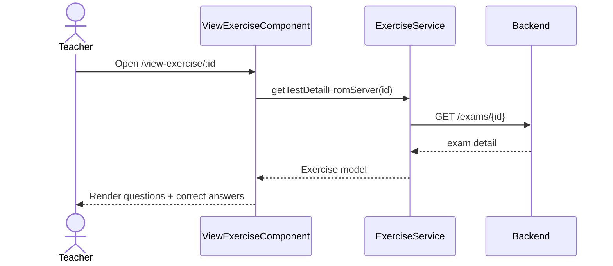

# Màn hình chi tiết bài thi

## Thông tin chung

| Mục | Nội dung |
| --- | --- |
| Route | `/view-exercise/:id` |
| Wrapper | `StudentLayoutComponent` |
| Component | `ViewExerciseComponent` |
| Tác nhân | Chủ yếu là giáo viên |
| Mục tiêu | Xem chi tiết bài thi, câu hỏi và đáp án đúng |

## Thành phần giao diện

- Tên bài thi.
- Metadata: số câu hỏi và trạng thái.
- Danh sách câu hỏi.
- Ảnh câu hỏi nếu có.
- Danh sách đáp án và indicator đáp án đúng.

## Hành động

- Load chi tiết bài thi theo route param `id`.
- Quay lại `/exercise-list`.

## Dữ liệu và API

- `ExerciseService.getTestDetailFromServer(id)` -> `GET /exams/{id}`.
- `ApiService.getImageUrl(filename)` để hiện ảnh.

## Đối chiếu production

- Đã mở từ nút `Xem bài thi` trên danh sách ngày 28/07/2026.
- Phần đầu hiển thị tên bài, mô tả mặc định, số câu, trạng thái và nút quay lại.
- Khối thống kê phân loại số câu một đáp án/nhiều đáp án.
- Toàn bộ câu hỏi được hiển thị nối tiếp trên một trang; đáp án đúng được đánh
  dấu và ảnh xuất hiện tại câu có dữ liệu ảnh.
- Route dùng `StudentLayoutComponent` trong routing dù đây là luồng giáo viên.

## Sơ đồ luồng




## Mô tả giao diện

Trang đọc chi tiết bài thi. Phần đầu hiển thị tên, mô tả, số câu, trạng thái và nút quay lại. Bên dưới là thống kê nhanh và danh sách đầy đủ câu hỏi; đáp án đúng được tô nổi bật, ảnh và giải thích xuất hiện khi có dữ liệu.

## Wireframe giao diện

Wireframe low-fidelity dưới đây mô tả vị trí tương đối của các vùng UI trên desktop. Trên màn hình nhỏ, các cột và card được xếp dọc theo CSS responsive hiện tại.

```text
+--------------------------------------------------------------------------------+
| Header giáo viên                                                               |
+--------------------------------------------------------------------------------+
| TÊN BÀI THI                                                 [← Quay lại]       |
| Mô tả bài thi                                                                  |
| Số câu: {n}              Trạng thái: Đã xuất bản                               |
+--------------------------------------------------------------------------------+
| CHI TIẾT BÀI TẬP                                                              |
| [Tổng câu: n] [Loại câu: ...] [Trạng thái: Đã xuất bản]                       |
+--------------------------------------------------------------------------------+
| Câu 1: Nội dung câu hỏi                                      [Một đáp án]      |
| +-------------------------- Ảnh minh họa -------------------------------+      |
| | A. Nội dung đáp án                                                       |   |
| | B. Nội dung đáp án đúng                                            [✓]  |   |
| | C. Nội dung đáp án                                                       |   |
| +-------------------------------------------------------------------------+   |
| Giải thích: ...                                                               |
+--------------------------------------------------------------------------------+
| Câu 2 ... Câu n                                                               |
+--------------------------------------------------------------------------------+
| Footer                                                                         |
+--------------------------------------------------------------------------------+
```

## Use case liên quan

- [UC-TEACHER-006: Xem chi tiết bài thi](../usecases/uc-teacher-006-view-exam-detail.md)
