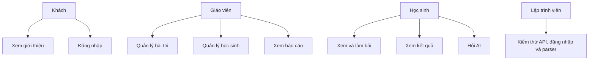

# Danh mục use case

Mỗi use case có một file riêng. Màn hình liên quan được liên kết ngay trong bảng `Tóm tắt` của từng UC.

Các use case đã được đi lại trên production ngày 28/07/2026. Hai luồng gửi
request tới AI chỉ được đối chiếu bằng UI và source code vì tài khoản không còn
quota. Những thao tác có khả năng ghi hoặc xóa dữ liệu
(lưu bài, nộp bài, import, xóa) chỉ được kiểm tra tới bước trước khi xác nhận,
sau đó đối chiếu nhánh API bằng source code.

## Khách

| ID | Use case |
| --- | --- |
| UC-GUEST-001 | [Xem trang giới thiệu](usecases/uc-guest-001-view-landing.md) |
| UC-GUEST-002 | [Đăng nhập](usecases/uc-guest-002-login.md) |

## Giáo viên

| ID | Use case |
| --- | --- |
| UC-TEACHER-001 | [Xem dashboard giáo viên](usecases/uc-teacher-001-view-dashboard.md) |
| UC-TEACHER-002 | [Tạo bài thi](usecases/uc-teacher-002-create-exam.md) |
| UC-TEACHER-003 | [Phân tích câu hỏi từ văn bản](usecases/uc-teacher-003-parse-questions.md) |
| UC-TEACHER-004 | [Tải ảnh câu hỏi](usecases/uc-teacher-004-upload-question-image.md) |
| UC-TEACHER-005 | [Xem danh sách bài thi](usecases/uc-teacher-005-list-exams.md) |
| UC-TEACHER-006 | [Xem chi tiết bài thi](usecases/uc-teacher-006-view-exam-detail.md) |
| UC-TEACHER-007 | [Xóa bài thi](usecases/uc-teacher-007-delete-exam.md) |
| UC-TEACHER-008 | [Quản lý học sinh](usecases/uc-teacher-008-manage-students.md) |
| UC-TEACHER-009 | [Import học sinh bằng Excel/CSV](usecases/uc-teacher-009-import-students.md) |
| UC-TEACHER-010 | [Tải template học sinh](usecases/uc-teacher-010-download-student-template.md) |
| UC-TEACHER-011 | [Xóa học sinh](usecases/uc-teacher-011-delete-student.md) |
| UC-TEACHER-012 | [Xem báo cáo bài thi](usecases/uc-teacher-012-view-reports.md) |
| UC-TEACHER-013 | [Xem chi tiết kết quả một bài thi](usecases/uc-teacher-013-view-report-detail.md) |

## Học sinh

| ID | Use case |
| --- | --- |
| UC-STUDENT-001 | [Xem danh sách bài thi](usecases/uc-student-001-list-exams.md) |
| UC-STUDENT-002 | [Làm bài thi](usecases/uc-student-002-take-exam.md) |
| UC-STUDENT-003 | [Làm bài có giới hạn thời gian](usecases/uc-student-003-timed-exam.md) |
| UC-STUDENT-004 | [Xem kết quả bài thi](usecases/uc-student-004-view-result.md) |
| UC-STUDENT-005 | [Yêu cầu AI giải thích](usecases/uc-student-005-ai-explanation.md) |
| UC-STUDENT-006 | [Trò chuyện với BioBot](usecases/uc-student-006-chatbot.md) |

## Lập trình viên

| ID | Use case |
| --- | --- |
| UC-DEV-001 | [Kiểm thử API bài thi](usecases/uc-dev-001-api-test.md) |
| UC-DEV-002 | [Kiểm thử bộ phân tích câu hỏi](usecases/uc-dev-002-parse-demo.md) |
| UC-DEV-003 | [Kiểm thử đăng nhập](usecases/uc-dev-003-login-test.md) |

## Sơ đồ tổng quan

