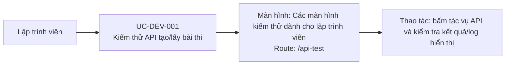

# UC-DEV-001: Kiểm thử API tạo/lấy bài thi

## Tóm tắt

| Mục | Nội dung |
| --- | --- |
| Tác nhân | Developer |
| Màn hình liên quan | [Các màn hình kiểm thử dành cho lập trình viên](../screens/dev-test-screens.md) |
| Route | `/api-test` |
| Mục tiêu | Test nhanh API exam |
| Kết quả thành công | Lập trình viên thấy response/log |
| Đối chiếu | Production ngày 28/07/2026; chỉ chạy tác vụ lấy danh sách |

## Luồng chính

### Use case diagram

### Các bước thao tác

1. Lập trình viên truy cập
   [các màn hình kiểm thử dành cho lập trình viên](../screens/dev-test-screens.md)
   tại `/api-test`.
2. Lập trình viên bấm `Test Lấy Danh Sách` để gọi API lấy bài thi.
3. Component gọi `ApiService.getTests()` và hiển thị response JSON trong vùng kết quả.
4. Khi cần kiểm thử tạo dữ liệu trên môi trường phù hợp, lập trình viên bấm
   `Test Tạo Bài Thi`; component gọi `ApiService.createTest()`.

## Lưu ý

- Route đang public và nút tạo bài có thể ghi dữ liệu thật. Không dùng tác vụ tạo
  trên production nếu không có kế hoạch dọn dữ liệu.
