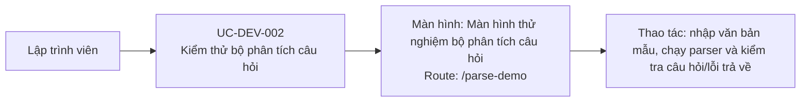

# UC-DEV-002: Kiểm thử bộ phân tích câu hỏi

## Tóm tắt

| Mục | Nội dung |
| --- | --- |
| Tác nhân | Developer |
| Màn hình liên quan | [Màn hình thử nghiệm bộ phân tích câu hỏi](../screens/parse-demo.md) |
| Route | `/parse-demo` |
| Mục tiêu | Kiểm tra logic parse văn bản |
| Kết quả thành công | Parsed questions/errors hiện trên UI |
| Đối chiếu | Production ngày 28/07/2026; nạp và parse thành công mẫu ba câu |

## Luồng chính

### Use case diagram

### Các bước thao tác

1. Lập trình viên mở
   [màn hình thử nghiệm bộ phân tích câu hỏi](../screens/parse-demo.md) tại
   `/parse-demo`.
2. Lập trình viên nhập văn bản hoặc bấm `Load Mẫu`.
3. Lập trình viên bấm `Parse Câu Hỏi`.
4. Component gọi `ExerciseService.parseQuestions()`.
5. UI hiển thị số câu đã parse, loại `Single Choice`/`Multiple Choice`, danh sách
   đáp án và dấu xác nhận tại đáp án đúng.
6. Lập trình viên bấm `Xóa` để xóa nội dung và kết quả khi cần.
