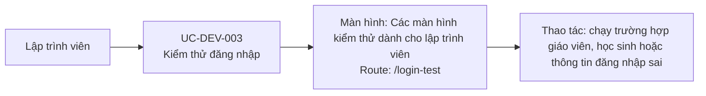

# UC-DEV-003: Kiểm thử đăng nhập

## Tóm tắt

| Mục | Nội dung |
| --- | --- |
| Tác nhân | Developer |
| Màn hình liên quan | [Các màn hình kiểm thử dành cho lập trình viên](../screens/dev-test-screens.md) |
| Route | `/login-test` |
| Mục tiêu | Test nhanh các case login |
| Kết quả thành công | Lập trình viên thấy kết quả teacher/student/invalid login |
| Đối chiếu | Đã xác nhận UI production ngày 28/07/2026; không chạy các nút |

## Luồng chính

### Use case diagram

### Các bước thao tác

1. Lập trình viên truy cập
   [các màn hình kiểm thử dành cho lập trình viên](../screens/dev-test-screens.md)
   tại `/login-test`.
2. Lập trình viên chọn `Test Teacher Login (Fixed)`, `Test Student Login (API)`
   hoặc `Test Invalid Login`.
3. Component gọi `AuthService.login()`, service gửi `POST /login`.
4. UI hiển thị kết quả thành công hoặc lỗi của trường hợp đã chọn.

## Lưu ý

- Route đang public và các nút có thể thay đổi phiên xác thực hiện tại.
