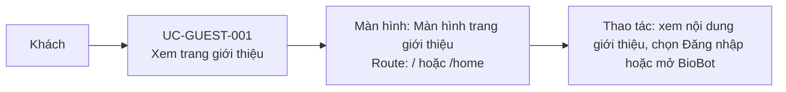

# UC-GUEST-001: Xem trang giới thiệu

## Tóm tắt

| Mục | Nội dung |
| --- | --- |
| Tác nhân | Khách |
| Màn hình liên quan | [Màn hình trang giới thiệu](../screens/landing-page.md) |
| Mục tiêu | Hiểu ứng dụng và đi tới đăng nhập |
| Tiền điều kiện | Không cần đăng nhập |
| Kích hoạt | Người dùng vào `/` hoặc `/home` |
| Kết quả thành công | Landing page hiển thị và người dùng có thể chọn đăng nhập |
| Đối chiếu | Production ngày 28/07/2026; không gửi tin nhắn BioBot |

## Luồng chính

### Use case diagram

### Các bước thao tác

1. Khách truy cập [màn hình trang giới thiệu](../screens/landing-page.md) tại `/`
   hoặc `/home`.
2. Hệ thống hiển thị header, nội dung giới thiệu BioEduTech, các tính năng AI và
   chương trình Sinh học lớp 10, 11, 12.
3. Khách bấm `Đăng nhập` trên header.
4. Hệ thống điều hướng tới [màn hình đăng nhập](../screens/login.md) tại `/login`.

## Luồng thay thế

- Người dùng mở chatbot: `ChatbotComponent` hiện panel chat.
- Chatbot lỗi API: UI hiện lỗi trong panel chat.
