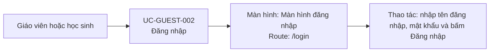

# UC-GUEST-002: Đăng nhập

## Tóm tắt

| Mục | Nội dung |
| --- | --- |
| Tác nhân | Giáo viên, học sinh |
| Màn hình liên quan | [Màn hình đăng nhập](../screens/login.md) |
| Mục tiêu | Xác thực người dùng và vào dashboard đúng role |
| Tiền điều kiện | Người dùng có username/password trên backend |
| Kích hoạt | Người dùng gửi biểu mẫu login |
| Kết quả thành công | Người dùng được điều hướng theo role |
| Đối chiếu | Đăng nhập thành công cả hai vai trò trên production ngày 28/07/2026 |

## Luồng chính

### Use case diagram

### Các bước thao tác

1. Người dùng truy cập [màn hình đăng nhập](../screens/login.md) tại `/login`.
2. Người dùng nhập tên đăng nhập và mật khẩu, sau đó bấm `Đăng nhập`.
3. Hệ thống kiểm tra hai trường bắt buộc và gọi `POST /login`.
4. Backend trả thông tin người dùng cùng `role`.
5. Với `teacher`, hệ thống điều hướng tới `/teacher`; với `student`, hệ thống
   điều hướng tới `/student`.

## Luồng thay thế

- Thiếu username/password: hiện snackbar.
- Sai credentials hoặc API lỗi: hiện snackbar lỗi.
- Role không hợp lệ: không điều hướng vào dashboard.
