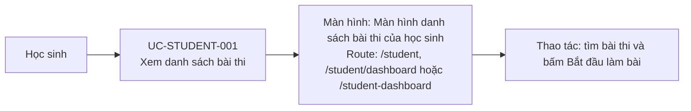

# UC-STUDENT-001: Xem danh sách bài thi

## Tóm tắt

| Mục | Nội dung |
| --- | --- |
| Tác nhân | Học sinh |
| Màn hình liên quan | [Màn hình danh sách bài thi của học sinh](../screens/student-dashboard.md) |
| Mục tiêu | Tìm bài thi có thể làm |
| Tiền điều kiện | Học sinh vào dashboard |
| Kích hoạt | Vào `/student` |
| Kết quả thành công | Danh sách bài thi hiển thị |
| Đối chiếu | Production ngày 28/07/2026 |

## Luồng chính

### Use case diagram

### Các bước thao tác

1. Sau khi đăng nhập thành công, học sinh được chuyển tới
   [màn hình danh sách bài thi](../screens/student-dashboard.md) tại `/student`;
   các route tương đương là `/student/dashboard` và `/student-dashboard`.
2. Hệ thống gọi `GET /exams?page=1&limit=1000` và hiển thị tối đa 10 card trên
   mỗi trang cục bộ.
3. Học sinh xem tên bài, số câu hỏi và các metadata khác nếu API có trả dữ liệu.
4. Học sinh nhập tên bài vào ô tìm kiếm; danh sách lọc ngay và hiện trạng thái
   không tìm thấy khi không có kết quả.
5. Học sinh bấm card hoặc `Bắt đầu làm bài`.
6. Hệ thống điều hướng tới [màn hình làm bài](../screens/take-exam.md) tại
   `/student/exam/:id`.

## Luồng thay thế

- API lỗi: hiện lỗi state.
- Không có bài thi: hiện trạng thái rỗng.
