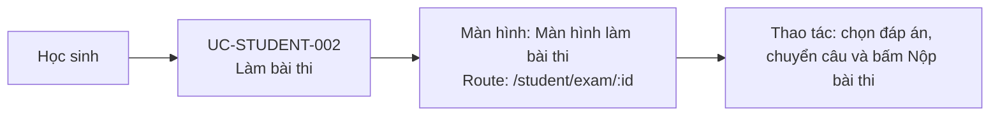

# UC-STUDENT-002: Làm bài thi

## Tóm tắt

| Mục | Nội dung |
| --- | --- |
| Tác nhân | Học sinh |
| Màn hình liên quan | [Màn hình làm bài thi](../screens/take-exam.md) |
| Mục tiêu | Trả lời câu hỏi trong bài thi |
| Tiền điều kiện | Bài thi active và có ID |
| Kích hoạt | Học sinh vào `/student/exam/:id` |
| Kết quả thành công | Học sinh nộp bài và sang trang kết quả |
| Đối chiếu | Production ngày 28/07/2026; đã chọn đáp án và chuyển câu, không nộp |

## Luồng chính

### Use case diagram

### Các bước thao tác

1. Từ danh sách bài thi, học sinh bấm `Bắt đầu làm bài`; hệ thống mở
   [màn hình làm bài thi](../screens/take-exam.md) tại `/student/exam/:id`.
2. Hệ thống gọi `GET /exams/{id}`, khởi tạo câu trả lời rỗng và timer nếu đề có
   cấu hình thời gian.
3. Học sinh chọn radio với câu một đáp án hoặc checkbox với câu nhiều đáp án.
4. Học sinh chuyển câu bằng `Câu trước`, `Câu sau` hoặc số câu trong sidebar;
   thanh tiến độ cập nhật theo số câu đã trả lời.
5. Học sinh bấm `Nộp bài thi` và xác nhận.
6. Hệ thống gọi `POST /exams/{id}/submit`.
7. Khi nộp thành công, hệ thống chuyển tới
   [màn hình kết quả](../screens/exam-result.md) tại
   `/student/exam-result/:id?answers=...`.

## Luồng thay thế

- Hết giờ: hệ thống tự nộp, không cần xác nhận.
- Load đề lỗi: hiện lỗi state.
- Submit lỗi: hiện lỗi state.
