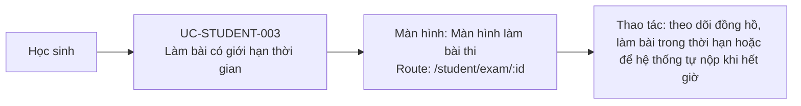

# UC-STUDENT-003: Làm bài có giới hạn thời gian

## Tóm tắt

| Mục | Nội dung |
| --- | --- |
| Tác nhân | Học sinh |
| Màn hình liên quan | [Màn hình làm bài thi](../screens/take-exam.md) |
| Mục tiêu | Giới hạn thời gian làm bài |
| Tiền điều kiện | Bài thi có `timer` hoặc `time_limit` |
| Kích hoạt | Màn hình làm bài khởi tạo |
| Kết quả thành công | Timer đếm ngược và tự nộp khi hết giờ |
| Đối chiếu | Production ngày 28/07/2026 với bài 30 phút; không chờ hết giờ |

## Luồng chính

### Use case diagram

### Các bước thao tác

1. Học sinh mở [màn hình làm bài thi](../screens/take-exam.md) tại
   `/student/exam/:id`.
2. Hệ thống ưu tiên đọc `exam.timer`; nếu không có thì đổi `time_limit` từ phút
   sang giây.
3. `TimerService` bắt đầu đếm ngược và đồng hồ xuất hiện ở phần đầu màn hình.
4. Học sinh làm bài trong thời gian còn lại; UI đổi trạng thái khi tới ngưỡng
   cảnh báo hoặc nguy cấp.
5. Khi đồng hồ về 0, hệ thống dừng timer và tự động thực hiện luồng nộp bài.

## Luồng thay thế

- Timer format sai: timer không start, exam có thể chạy không giới hạn.
- Người dùng nộp trước khi hết giờ: timer dừng và hệ thống nộp thủ công.
