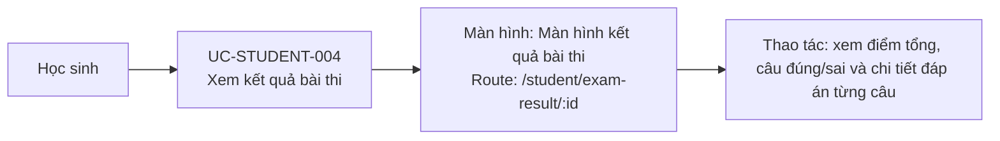

# UC-STUDENT-004: Xem kết quả bài thi

## Tóm tắt

| Mục | Nội dung |
| --- | --- |
| Tác nhân | Học sinh |
| Màn hình liên quan | [Màn hình kết quả bài thi](../screens/exam-result.md) |
| Mục tiêu | Biết điểm và các câu đúng/sai |
| Tiền điều kiện | Học sinh đã nộp bài và có query `answers` |
| Kích hoạt | Navigate `/student/exam-result/:id` |
| Kết quả thành công | Kết quả hiển thị |
| Đối chiếu | Production ngày 28/07/2026 bằng bộ đáp án rỗng; không gọi AI |

## Luồng chính

### Use case diagram

### Các bước thao tác

1. Sau khi nộp bài, hệ thống mở
   [màn hình kết quả bài thi](../screens/exam-result.md) tại
   `/student/exam-result/:id?answers=...`.
2. Component parse query `answers` và gọi `GET /exams/{id}`.
3. Hệ thống so sánh từng câu trả lời với `correct_answers`, rồi tính số câu đúng,
   số câu sai và tỷ lệ phần trăm ở frontend.
4. Học sinh xem phần tổng quan và danh sách chi tiết từng câu, gồm đáp án đã chọn
   và đáp án đúng.
5. Học sinh có thể bấm `Làm lại` để quay về `/student/exam/:id` hoặc
   `Quay lại Dashboard` để về `/student`.

## Luồng thay thế

- Query `answers` thiếu/sai JSON: kết quả có thể rỗng hoặc lỗi parse.
- API load đề lỗi: hiện lỗi state.
