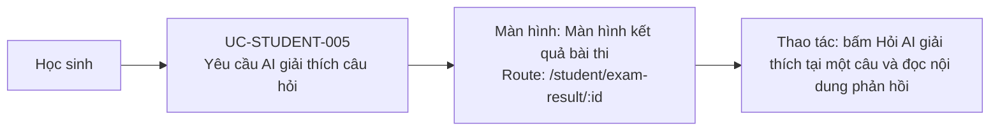

# UC-STUDENT-005: Yêu cầu AI giải thích câu hỏi

## Tóm tắt

| Mục | Nội dung |
| --- | --- |
| Tác nhân | Học sinh |
| Màn hình liên quan | [Màn hình kết quả bài thi](../screens/exam-result.md) |
| Mục tiêu | Hiểu vì sao đáp án đúng/sai |
| Tiền điều kiện | Đang ở màn kết quả |
| Kích hoạt | Bấm hỏi AI ở một câu |
| Kết quả thành công | AI explanation hiện trong câu đó |
| Đối chiếu | Đã xác nhận nút trên production; không gọi AI vì tài khoản hết quota |

## Luồng chính

### Use case diagram

### Các bước thao tác

1. Học sinh mở [màn hình kết quả bài thi](../screens/exam-result.md) tại
   `/student/exam-result/:id?answers=...`.
2. Tại câu cần tìm hiểu, học sinh bấm nút yêu cầu AI giải thích.
3. Hệ thống tạo prompt từ nội dung câu hỏi, danh sách đáp án, đáp án đúng và đáp
   án học sinh đã chọn.
4. `AIExplanationService.getExplanation()` gửi request tới OpenAI Chat Completions.
5. Khi có phản hồi, hệ thống hiển thị nội dung giải thích ngay trong khối câu hỏi.

## Luồng thay thế

- OpenAI trả lỗi quota, xác thực, CORS hoặc lỗi mạng: component hiện thông báo lỗi.
- Response không có `choices`: hiện lỗi không nhận được phản hồi AI.
