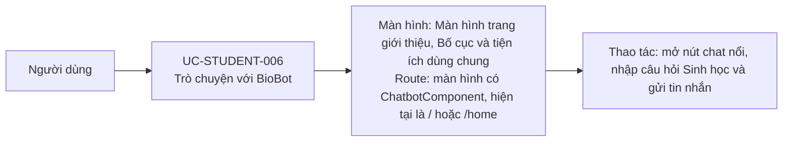

# UC-STUDENT-006: Trò chuyện với BioBot

## Tóm tắt

| Mục | Nội dung |
| --- | --- |
| Tác nhân | Học sinh hoặc người dùng bất kỳ nơi chatbot được render |
| Màn hình liên quan | [Màn hình trang giới thiệu](../screens/landing-page.md) [Bố cục và tiện ích dùng chung](../screens/shared-layout-widgets.md) |
| Mục tiêu | Hỏi đáp kiến thức Sinh học |
| Tiền điều kiện | `ChatbotComponent` được render |
| Kích hoạt | Người dùng mở chat và gửi message |
| Kết quả thành công | AI trả lời trong chat panel |
| Đối chiếu | Đối chiếu UI và code; không gửi tin nhắn vì tài khoản hết quota |

## Luồng chính

### Use case diagram

### Các bước thao tác

1. Người dùng mở [màn hình trang giới thiệu](../screens/landing-page.md) tại `/`
   hoặc `/home`, nơi `ChatbotComponent` được render.
2. Người dùng bấm nút chat nổi để mở panel BioBot.
3. Người dùng nhập câu hỏi Sinh học và bấm gửi.
4. Hệ thống thêm tin nhắn người dùng vào lịch sử và gọi
   `ChatbotService.sendMessage()`.
5. Service gửi request tới OpenAI Chat Completions.
6. Hệ thống hiển thị câu trả lời trong panel và lưu lịch sử vào localStorage.

## Luồng thay thế

- Message rỗng: không gửi.
- OpenAI lỗi/quota/CORS: hiện lỗi trong chat.
