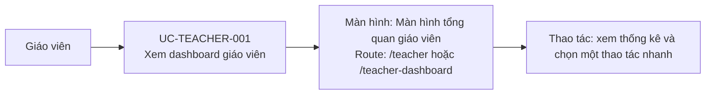

# UC-TEACHER-001: Xem dashboard giáo viên

## Tóm tắt

| Mục | Nội dung |
| --- | --- |
| Tác nhân | Giáo viên |
| Màn hình liên quan | [Màn hình tổng quan giáo viên](../screens/teacher-dashboard.md) |
| Mục tiêu | Xem tổng quan lớp và bài thi |
| Tiền điều kiện | Đã đăng nhập role `teacher` |
| Kích hoạt | Vào `/teacher` hoặc `/teacher-dashboard` |
| Kết quả thành công | Dashboard hiện thống kê và quick actions |
| Đối chiếu | Production ngày 28/07/2026 |

## Luồng chính

### Use case diagram

### Các bước thao tác

1. Sau khi đăng nhập thành công, giáo viên được chuyển tới
   [màn hình tổng quan giáo viên](../screens/teacher-dashboard.md) tại `/teacher`;
   route tương đương là `/teacher-dashboard`.
2. Hệ thống kiểm tra giáo viên hiện tại trong `AuthService`.
3. Hệ thống gọi `GET /exams?page=1&limit=100`,
   `GET /users?page=1&limit=100&role=student` và lấy thống kê từ
   `ExerciseService.getExerciseStats()`.
4. Dashboard hiển thị lời chào, hai số tổng và bốn thao tác nhanh.
5. Giáo viên bấm `Tạo bài tập trắc nghiệm`, `Quản lý bài tập`,
   `Quản lý học sinh` hoặc `Xem báo cáo` để mở màn hình nghiệp vụ tương ứng.

## Luồng thay thế

- Không có teacher trong auth state: điều hướng `/login`.
- API lỗi: hiện snackbar/trạng thái lỗi tùy hàm hiện tại.
- Endpoint học sinh trả `count` không khớp tập người dùng đã lọc: dashboard có thể
  hiển thị tổng số học sinh cao hơn thực tế.
