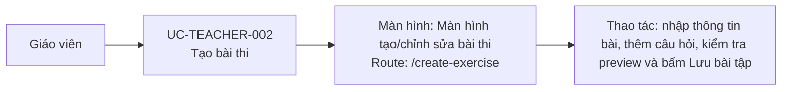

# UC-TEACHER-002: Tạo bài thi

## Tóm tắt

| Mục | Nội dung |
| --- | --- |
| Tác nhân | Giáo viên |
| Màn hình liên quan | [Màn hình tạo/chỉnh sửa bài thi](../screens/create-edit-exercise.md) |
| Mục tiêu | Tạo bài thi trắc nghiệm mới |
| Tiền điều kiện | Giáo viên ở `/create-exercise` |
| Kích hoạt | Giáo viên bấm lưu bài |
| Kết quả thành công | Bài thi được tạo trên backend |
| Đối chiếu | Production ngày 28/07/2026 tới bước preview; không bấm lưu |

## Luồng chính

### Use case diagram

### Các bước thao tác

1. Từ header giáo viên, giáo viên bấm `Tạo bài`; hệ thống mở
   [màn hình tạo/chỉnh sửa bài thi](../screens/create-edit-exercise.md) tại
   `/create-exercise`.
2. Giáo viên nhập tên bài và thời gian nếu cần.
3. Giáo viên dán văn bản để parse hoặc bấm `Thêm câu hỏi thủ công`.
4. Giáo viên rà soát nội dung, loại câu hỏi, đáp án đúng và ảnh của từng câu.
5. Giáo viên chuyển giữa tab thông tin bài và góc nhìn học sinh để kiểm tra preview.
6. Giáo viên bấm `Lưu bài tập`; hệ thống kiểm tra form và cấu trúc câu hỏi.
7. Hệ thống gửi `POST /exams`, thông báo thành công và điều hướng `/exercise-list`.

## Luồng thay thế

- Form thiếu tên bài: hiện lỗi field.
- Timer sai format: hiện lỗi field.
- Không có câu hỏi: alert.
- Câu hỏi thiếu nội dung/đáp án đúng: alert.
- API lỗi: alert lỗi tạo bài.
