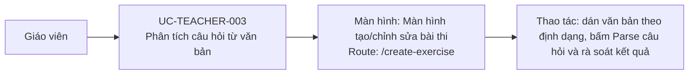

# UC-TEACHER-003: Phân tích câu hỏi từ văn bản

## Tóm tắt

| Mục | Nội dung |
| --- | --- |
| Tác nhân | Giáo viên |
| Màn hình liên quan | [Màn hình tạo/chỉnh sửa bài thi](../screens/create-edit-exercise.md) |
| Mục tiêu | Tạo nhanh danh sách câu hỏi từ text |
| Tiền điều kiện | Có nội dung theo đúng định dạng parser |
| Kích hoạt | Bấm parse |
| Kết quả thành công | `questions` được tạo trong form |
| Đối chiếu | Đã parse thành công một câu trên production ngày 28/07/2026 |

## Luồng chính

### Use case diagram

### Các bước thao tác

1. Giáo viên mở [màn hình tạo/chỉnh sửa bài thi](../screens/create-edit-exercise.md)
   tại `/create-exercise`.
2. Giáo viên dán câu hỏi theo mẫu `a)`, `b)`, `c)` và thêm `(đúng)` sau đáp án đúng.
3. Giáo viên bấm `Parse câu hỏi`.
4. `ExerciseService.parseQuestions()` tách nội dung câu hỏi, đáp án và chỉ số đáp
   án đúng, sau đó cập nhật danh sách câu hỏi trên form.
5. Giáo viên rà soát từng câu, sửa loại câu hỏi hoặc đáp án nếu cần.
6. Khi có câu hỏi hợp lệ, tab preview góc nhìn học sinh được bật.

## Luồng thay thế

- Text rỗng: không parse được, hiện lỗi/kết quả rỗng.
- Không có marker đáp án đúng: câu hỏi cần được sửa thủ công.
- Format đáp án không đúng `a)`, `b)`: parser có thể bỏ qua.
