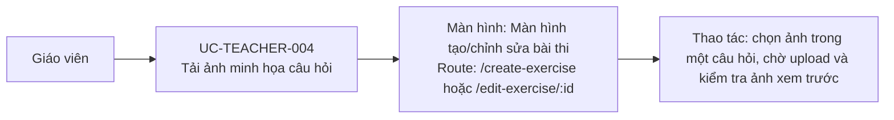

# UC-TEACHER-004: Tải ảnh minh họa câu hỏi

## Tóm tắt

| Mục | Nội dung |
| --- | --- |
| Tác nhân | Giáo viên |
| Màn hình liên quan | [Màn hình tạo/chỉnh sửa bài thi](../screens/create-edit-exercise.md) |
| Mục tiêu | Thêm ảnh minh họa cho câu hỏi |
| Tiền điều kiện | Đang tạo bài và có câu hỏi |
| Kích hoạt | Chọn file ảnh |
| Kết quả thành công | Câu hỏi lưu filename ảnh backend trả về |
| Đối chiếu | Cấu trúc UI đã xác nhận trên production; upload đối chiếu từ code |

## Luồng chính

### Use case diagram

### Các bước thao tác

1. Giáo viên mở [màn hình tạo/chỉnh sửa bài thi](../screens/create-edit-exercise.md)
   tại `/create-exercise` hoặc `/edit-exercise/:id`.
2. Tại câu hỏi cần minh họa, giáo viên bấm chọn ảnh và chọn file JPG/PNG/GIF.
3. Hệ thống kiểm tra loại và kích thước file, sau đó gọi `POST /images`.
4. Backend trả `path` hoặc `filename`; hệ thống gắn tên file vào câu hỏi và hiển
   thị ảnh xem trước.

## Luồng thay thế

- File sai loại: từ chối upload.
- File quá lớn: từ chối upload.
- Upload lỗi: alert lỗi upload.
