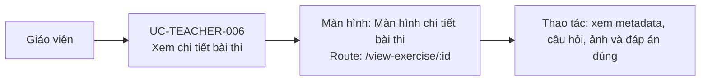

# UC-TEACHER-006: Xem chi tiết bài thi

## Tóm tắt

| Mục | Nội dung |
| --- | --- |
| Tác nhân | Giáo viên |
| Màn hình liên quan | [Màn hình chi tiết bài thi](../screens/view-exercise.md) |
| Mục tiêu | Xem toàn bộ nội dung và đáp án đúng |
| Tiền điều kiện | Bài thi có ID |
| Kích hoạt | Bấm xem bài thi |
| Kết quả thành công | Chi tiết bài thi hiển thị |
| Đối chiếu | Production ngày 28/07/2026 |

## Luồng chính

### Use case diagram

### Các bước thao tác

1. Trên [màn hình quản lý bài thi](../screens/exercise-list.md), giáo viên bấm
   `Xem bài thi` tại card cần kiểm tra.
2. Hệ thống mở [màn hình chi tiết bài thi](../screens/view-exercise.md) tại
   `/view-exercise/:id` và gọi `GET /exams/{id}`.
3. Giáo viên xem tên bài, số câu, trạng thái và thống kê loại câu hỏi.
4. Giáo viên cuộn danh sách để xem nội dung, ảnh và đáp án đúng của toàn bộ câu hỏi.
5. Giáo viên bấm `Quay lại` để trở về `/exercise-list`.

## Luồng thay thế

- ID không tồn tại/API lỗi: hiện lỗi load bài.
- Câu hỏi có ảnh: hệ thống build image URL từ backend.
