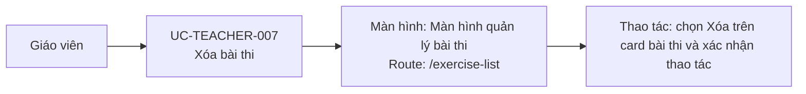

# UC-TEACHER-007: Xóa bài thi

## Tóm tắt

| Mục | Nội dung |
| --- | --- |
| Tác nhân | Giáo viên |
| Màn hình liên quan | [Màn hình quản lý bài thi](../screens/exercise-list.md) |
| Mục tiêu | Xóa bài thi khỏi backend |
| Tiền điều kiện | Bài thi có ID |
| Kích hoạt | Bấm xóa |
| Kết quả thành công | Bài thi bị xóa và danh sách reload |
| Đối chiếu | Nút xóa đã xác nhận trên production; nhánh xác nhận/API đối chiếu từ code |

## Luồng chính

### Use case diagram

### Các bước thao tác

1. Giáo viên mở [màn hình quản lý bài thi](../screens/exercise-list.md) tại
   `/exercise-list`.
2. Giáo viên bấm `Xóa` trên card bài thi cần xóa.
3. Hệ thống hiển thị hộp xác nhận; giáo viên xác nhận thao tác.
4. Hệ thống gọi `DELETE /exams/{id}`.
5. Khi API thành công, hệ thống tải lại danh sách và thông báo kết quả.

## Luồng thay thế

- Giáo viên hủy xác nhận: không gọi API.
- API lỗi: alert lỗi xóa.
