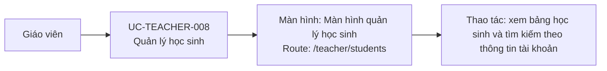

# UC-TEACHER-008: Quản lý học sinh

## Tóm tắt

| Mục | Nội dung |
| --- | --- |
| Tác nhân | Giáo viên |
| Màn hình liên quan | [Màn hình quản lý học sinh](../screens/student-management.md) |
| Mục tiêu | Xem và tìm kiếm danh sách học sinh |
| Tiền điều kiện | Giáo viên vào `/teacher/students` |
| Kích hoạt | Màn hình load |
| Kết quả thành công | Bảng học sinh hiển thị |
| Đối chiếu | Production ngày 28/07/2026 |

## Luồng chính

### Use case diagram

### Các bước thao tác

1. Từ header, giáo viên bấm `Học sinh`; hệ thống mở
   [màn hình quản lý học sinh](../screens/student-management.md) tại
   `/teacher/students`.
2. Hệ thống gọi `GET /users?role=student`, lọc vai trò học sinh và hiển thị bảng.
3. Giáo viên nhập tên, tên đăng nhập hoặc email vào ô tìm kiếm để lọc dữ liệu.
4. Giáo viên chọn 10, 20 hoặc 50 dòng mỗi trang và dùng các nút đầu, trước, sau,
   cuối để di chuyển trong danh sách.
5. Giáo viên mở menu ba chấm ở một dòng để thấy các thao tác `Chỉnh sửa` và `Xóa`.

## Ghi chú hiện trạng

- Phân trang hiện xử lý cục bộ sau khi API trả danh sách; tìm kiếm sẽ quay về
  trang đầu và phân trang lại tập kết quả.
- `Chỉnh sửa` chưa có form nghiệp vụ; code hiện chỉ hiển thị thông báo/TODO.

## Luồng thay thế

- API lỗi: hiện snackbar/error.
- Danh sách rỗng: hiện trạng thái rỗng.
