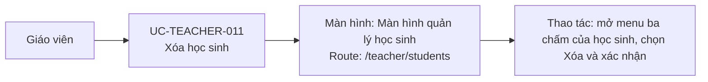

# UC-TEACHER-011: Xóa học sinh

## Tóm tắt

| Mục | Nội dung |
| --- | --- |
| Tác nhân | Giáo viên |
| Màn hình liên quan | [Màn hình quản lý học sinh](../screens/student-management.md) |
| Mục tiêu | Xóa người dùng học sinh |
| Tiền điều kiện | Học sinh có ID |
| Kích hoạt | Bấm action xóa |
| Kết quả thành công | Học sinh bị xóa khỏi backend và list local |
| Đối chiếu | Menu xóa đã xác nhận trên production; không thực hiện xóa |

## Luồng chính

### Use case diagram

### Các bước thao tác

1. Giáo viên mở [màn hình quản lý học sinh](../screens/student-management.md) tại
   `/teacher/students`.
2. Giáo viên mở menu ba chấm của học sinh cần xóa và chọn `Xóa`.
3. Hệ thống hiển thị xác nhận; giáo viên đồng ý xóa.
4. Hệ thống gọi `DELETE /users/{id}`.
5. Khi API thành công, hệ thống loại học sinh khỏi danh sách hoặc tải lại dữ liệu,
   rồi hiển thị snackbar thành công.

## Luồng thay thế

- Giáo viên hủy xác nhận: không gọi API.
- API lỗi: snackbar lỗi.
