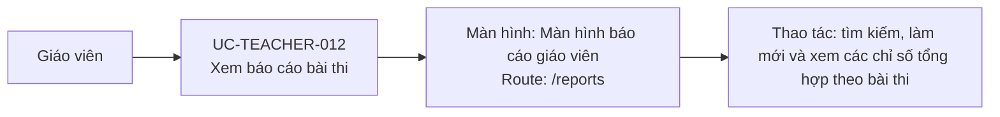

# UC-TEACHER-012: Xem báo cáo bài thi

## Tóm tắt

| Mục | Nội dung |
| --- | --- |
| Tác nhân | Giáo viên |
| Màn hình liên quan | [Màn hình báo cáo giáo viên](../screens/teacher-reports.md) |
| Mục tiêu | Xem thống kê submission theo bài |
| Tiền điều kiện | Có danh sách bài thi |
| Kích hoạt | Giáo viên vào `/reports` |
| Kết quả thành công | Bảng báo cáo hiển thị |
| Đối chiếu | Production ngày 28/07/2026 |

## Luồng chính

### Use case diagram

### Các bước thao tác

1. Từ header, giáo viên bấm `Báo cáo`; hệ thống mở
   [màn hình báo cáo giáo viên](../screens/teacher-reports.md) tại `/reports`.
2. Hệ thống gọi `GET /exams`, sau đó gọi `GET /exams/{id}/results` cho từng bài.
3. Hệ thống tính số lượt làm, điểm trung bình, thời gian làm trung bình và lần
   làm cuối rồi hiển thị bảng.
4. Giáo viên nhập tên bài thi để tìm kiếm hoặc bấm `Làm mới` để tải lại dữ liệu.

## Ghi chú hiện trạng

- Cách gọi một request kết quả cho từng bài tạo số lượng request tỷ lệ với số bài thi.

## Luồng thay thế

- API lấy danh sách bài lỗi: hiện lỗi.
- API result của một bài lỗi: bài đó có thể hiện thống kê mặc định/lỗi tùy code.
