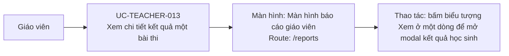

# UC-TEACHER-013: Xem chi tiết kết quả một bài thi

## Tóm tắt

| Mục | Nội dung |
| --- | --- |
| Tác nhân | Giáo viên |
| Màn hình liên quan | [Màn hình báo cáo giáo viên](../screens/teacher-reports.md) |
| Mục tiêu | Xem từng submission của học sinh |
| Tiền điều kiện | Bài thi có kết quả |
| Kích hoạt | Bấm xem chi tiết trên report |
| Kết quả thành công | Modal chi tiết mở |
| Đối chiếu | Production ngày 28/07/2026; đã mở modal, không thay đổi dữ liệu |

## Luồng chính

### Use case diagram

### Các bước thao tác

1. Giáo viên mở [màn hình báo cáo giáo viên](../screens/teacher-reports.md) tại
   `/reports`.
2. Tại dòng bài thi cần xem, giáo viên bấm biểu tượng `Xem`.
3. Hệ thống gọi `GET /exams/{id}/results` và loại các bản ghi có `student === null`.
4. Modal hiển thị tên học sinh, điểm số, tỷ lệ đúng, thời gian làm và thời gian nộp.
5. Giáo viên cuộn bảng để xem các lượt làm và bấm nút đóng để quay lại báo cáo.

## Ghi chú hiện trạng

- Modal chưa có phân trang và đang render toàn bộ lượt làm của bài thi.

## Luồng thay thế

- Không có submission hợp lệ: modal hiện trạng thái rỗng.
- API lỗi: hiện thông báo lỗi.
